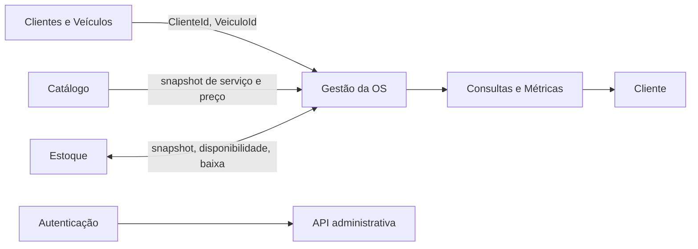
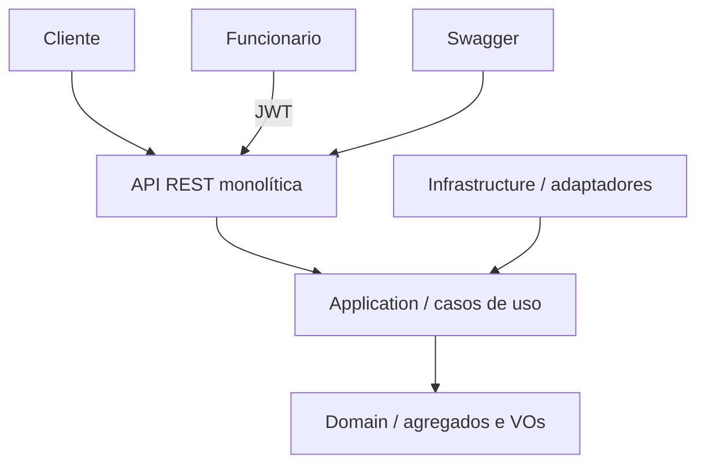

# Arquitetura, DDD e rastreabilidade

## Contextos

- Gestão da Ordem de Serviço (Core): OS, orçamento, diagnóstico, execução, finalização e entrega.
- Clientes e Veículos: Documento, Placa e responsabilidade pelo veículo.
- Catálogo: descrição, preço vigente e atividade do Serviço.
- Estoque: Peça/Insumo, saldo, baixa idempotente e estorno referenciado.
- Autenticação e Acesso: autenticação Bearer das rotas administrativas.
- Consultas e Métricas: acompanhamento público, listagem, detalhe e tempo médio de execução.

## C4

Dependências: `API -> Application -> Domain`; `Infrastructure -> Application + Domain`; Domain não referencia framework. O implantável é único e não há mensageria ou microsserviços.

## Event Storming resumido

| Ator | Comando | Agregado | Evento passado | Política |
|---|---|---|---|---|
| Atendente | Criar Ordem de Serviço | OrdemDeServico | OrdemDeServicoCriada | definir RECEBIDA |
| Mecânico | Iniciar Diagnóstico | OrdemDeServico | DiagnosticoIniciado | definir EM_DIAGNOSTICO |
| Sistema | Enviar Orçamento | OrdemDeServico | OrcamentoEnviado | definir AGUARDANDO_APROVACAO |
| Cliente | Aprovar/Reprovar Orçamento | OrdemDeServico | OrcamentoAprovado/Reprovado | liberar/bloquear execução |
| Mecânico | Iniciar Execução | OrdemDeServico | ExecucaoIniciada | exigir versão vigente aprovada |
| Mecânico | Consumir Peça | ItemEstoque | EstoqueBaixado | chave idempotente e saldo não negativo |
| Mecânico | Finalizar OS | OrdemDeServico | OrdemDeServicoFinalizada | exigir itens concluídos |
| Atendente | Entregar Veículo | OrdemDeServico | VeiculoEntregue | exigir FINALIZADA |

## Modelo e invariantes

`OrdemDeServico` é Aggregate Root e contém ItemOrdem, Orcamento, RegistroAndamento e TransicaoEstado. `Cliente`, `Veiculo`, `ServicoCatalogo` e `ItemEstoque` são roots independentes. Documento e Placa são Value Objects. Itens da OS guardam snapshots de descrição/preço; versões enviadas do orçamento são substituídas, nunca sobrescritas. Toda transição registra instante e causa. FINALIZADA e ENTREGUE são fatos distintos.

## Rastreabilidade

| Requisito | Implementação | Teste/contrato |
|---|---|---|
| CPF/CNPJ e placa | Documento, Placa | DomainRulesTests |
| orçamento automático/versionado | OrdemDeServico.GerarOrcamento | DomainRulesTests |
| execução somente aprovada | IniciarExecucao | DomainRulesTests |
| estoque seguro/idempotente | ItemEstoque | DomainRulesTests |
| acompanhamento público | `/publico/ordens-servico/{codigo}` | OpenAPI |
| JWT administrativo | JwtHandler + grupos protegidos | OpenAPI Bearer |
| tempo médio | TempoMedioExecucaoHoras | `/metricas/tempo-medio-execucao` |
