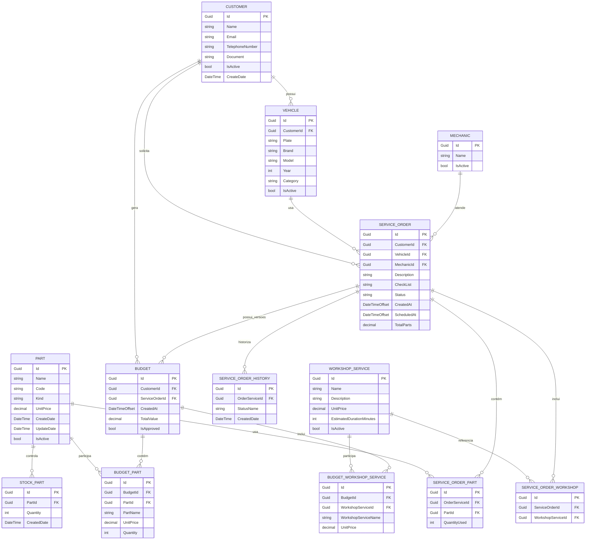

# Oficina API

API REST em .NET 10 para gestão operacional de uma oficina mecânica, cobrindo clientes, veículos, peças, estoque, mecânicos, serviços, ordens de serviço, orçamentos, histórico, métricas e notificações por e-mail.

## 🧭 Objetivo do projeto

O sistema foi concebido para centralizar e automatizar os processos da oficina, com foco em:

- cadastro e consulta de clientes e veículos;
- controle de peças e estoque;
- cadastro de mecânicos e serviços;
- abertura, atualização e acompanhamento de ordens de serviço;
- rastreio de histórico de status;
- geração e consulta de orçamentos;
- métricas de execução por serviço;
- envio de notificações por e-mail.

A solução segue princípios de Clean Architecture, separando domínio, aplicação, infraestrutura e API.

---

## 🏗️ Arquitetura

A estrutura do projeto está organizada em camadas:

- `src/Oficina.Domain` — entidades, regras de negócio e enums;
- `src/Oficina.Application` — serviços de aplicação, DTOs e contratos de repositório;
- `src/Oficina.Infrastructure` — EF Core, repositórios, SMTP, DI e persistência;
- `src/Oficina.Api` — controllers, autenticação, Swagger e bootstrap da API;
- `tests/Oficina.Tests` — testes unitários e de aplicação;
- `tests/Oficina.Api.ContractTests` — testes de contrato e integração HTTP.

Dependências:

- `Api -> Application -> Domain`
- `Infrastructure -> Application + Domain`

---

## 🧰 Stack tecnológica

- .NET 10
- ASP.NET Core
- C#
- Entity Framework Core
- PostgreSQL
- Npgsql
- JWT Bearer
- Swagger / OpenAPI
- Docker / Docker Compose
- SMTP para e-mail
- xUnit + WebApplicationFactory

---

## 📁 Estrutura do repositório

```text
.
├── src/
│   ├── Oficina.Api/
│   ├── Oficina.Application/
│   ├── Oficina.Domain/
│   └── Oficina.Infrastructure/
├── tests/
│   ├── Oficina.Tests/
│   └── Oficina.Api.ContractTests/
├── docs/
│   └── SYSTEM_CONTEXT.md
├── docker-compose.yml
├── Dockerfile
├── Oficina.sln
├── oficina.http
├── README.md
├── seed-data.sql
├── coverage.xml
├── RelatorioHTML/
└── TestResults/
```

---

## ⚙️ Requisitos mínimos

Antes de começar, verifique se você tem:

- .NET 10 SDK
- Docker e Docker Compose
- PostgreSQL (se for rodar sem Docker)
- VS Code, Rider ou Visual Studio
- Git

---

## 🚀 Como rodar a aplicação

### Passo 1: clone o projeto

```bash
git clone <url-do-repositorio>
cd 17SOAT-Fase1
```

### Passo 2: configure a aplicação

O projeto usa `appsettings.json` e também pode ler valores via variáveis de ambiente ou `.env` para manter segredos fora do repositório.

Exemplo de `appsettings.json`:

```json
{
  "ConnectionStrings": {
    "Database": "Host=localhost;Port=5432;Database=oficina;Username=oficina;Password=***"
  },
  "Jwt": {
    "Issuer": "Oficina.Api",
    "Audience": "Oficina.Administration",
    "SigningKey": "***",
    "ExpirationMinutes": 120
  },
  "Smtp": {
    "Host": "smtp.example.com",
    "Port": 587,
    "From": "noreply@example.com",
    "EnableSsl": true
  }
}
```

Exemplo de `.env`:

```env
ConnectionStrings__Database=Host=localhost;Port=5432;Database=oficina;Username=oficina;Password=sua_senha
Jwt__SigningKey=sua_chave_secreta
Smtp__Host=localhost
Smtp__Port=1025
Smtp__From=noreply@oficina.local
Smtp__EnableSsl=false
```

> Importante: nunca versionar segredos reais em Git.

### Passo 3: inicialize os serviços com Docker

Na raiz do projeto:

```bash
docker compose up --build -d
```

Isso sobe a API, PostgreSQL e Mailpit.

### Passo 4: verifique se a API subiu

Depois do startup, valide:

- API: `http://localhost:8080`
- Swagger: `http://localhost:8080/swagger`
- Health check: `http://localhost:8080/health`
- Mailpit: `http://localhost:8025`

### Passo 5: teste a API

Acesse o Swagger em:

```text
http://localhost:8080/swagger
```

No Swagger, use o endpoint de geração de token:

```http
POST /api/v1/auth/token
```

Copie o token e o envie em todas as requisições protegidas:

```http
Authorization: Bearer <accessToken>
```

---

## 🧪 Executando direto com .NET

Se preferir rodar sem Docker:

```bash
dotnet restore
dotnet build
dotnet run --project src/Oficina.Api/Oficina.Api.csproj
```

Antes disso, confirme que o PostgreSQL está acessível e que os dados de conexão estão corretos.

A aplicação também aplica as migrations automaticamente ao iniciar, fora do ambiente de testes.

---

## 🔐 Autenticação e autorização

A API usa autenticação JWT Bearer com token técnico único.

### Endpoints públicos

- `POST /api/v1/auth/token`
- `GET /health`

### Endpoints protegidos

A maior parte da API exige JWT, incluindo:

- clientes;
- veículos;
- peças;
- estoque;
- mecânicos;
- serviços;
- ordens de serviço;
- métricas;
- histórico.

> Observação: no estado atual, alguns endpoints como `BudgetsController` e `NotificationsController` ainda podem estar sem `[Authorize]` e isso deve ser revisado conforme a regra de acesso desejada.

---

## 🧾 Endpoints principais

### Auth

- `POST /api/v1/auth/token`

### Clientes

- `GET /api/v1/customers`
- `GET /api/v1/customers/{id}`
- `POST /api/v1/customers`
- `PUT /api/v1/customers/{id}`
- `DELETE /api/v1/customers/{id}`

### Veículos

- `GET /api/v1/vehicles`
- `GET /api/v1/vehicles/{id}`
- `POST /api/v1/vehicles`
- `POST /api/v1/vehicles/identify-customer-and-register`
- `PUT /api/v1/vehicles/{id}`
- `DELETE /api/v1/vehicles/{id}`

### Peças

- `GET /api/v1/parts`
- `GET /api/v1/parts/{id}`
- `POST /api/v1/parts`
- `PUT /api/v1/parts/{id}`
- `DELETE /api/v1/parts/{id}`

### Estoque

- `GET /api/v1/stocks`
- `GET /api/v1/stocks/{id}`
- `PUT /api/v1/stocks/stocks-part/{partId}/entries`
- `PUT /api/v1/stocks/stocks-part/{partId}/consumptions`
- `PUT /api/v1/stocks/stocks-part/{partId}/adjustments`

### Mecânicos

- `GET /api/v1/mechanics`
- `GET /api/v1/mechanics/{id}`
- `POST /api/v1/mechanics`
- `PUT /api/v1/mechanics/{id}`
- `DELETE /api/v1/mechanics/{id}`

### Serviços da oficina

- `GET /api/v1/workshop-services`
- `GET /api/v1/workshop-services/{id}`
- `POST /api/v1/workshop-services`
- `PUT /api/v1/workshop-services/{id}`
- `DELETE /api/v1/workshop-services/{id}`

### Ordens de serviço

- `GET /api/v1/service-orders`
- `GET /api/v1/service-orders/{id}`
- `POST /api/v1/service-orders`
- `PUT /api/v1/service-orders`
- `POST /api/v1/service-orders/{id}/approve`
- `POST /api/v1/service-orders/{id}/cancel`
- `POST /api/v1/service-orders/{id}/finalize`
- `POST /api/v1/service-orders/{id}/deliver`

### Histórico

- `GET /api/v1/service-order-history`
- `GET /api/v1/service-order-history/service-order/{serviceOrderId}`

### Orçamentos

- `GET /api/v1/budgets`
- `GET /api/v1/budgets/{id}`

### Métricas

- `GET /api/v1/metrics/workshop-service/execution-time`

### Notificações

- `POST /api/v1/notifications/email`

---

## 🔄 Fluxo de ordens de serviço

O ciclo de vida da OS é governado pelo domínio e por regras de negócio da aplicação. Uma ordem recém-aberta possui o status `Created` até o checklist ser informado.

Estados principais:

- `Created`
- `Received`
- `InDiagnosis`
- `AwaitingApproval`
- `InExecution`
- `Finalized`
- `Delivered`
- `Rejected`

Fluxo geral:

```text
Created -> Received -> InDiagnosis -> AwaitingApproval -> InExecution -> Finalized -> Delivered
InDiagnosis -> AwaitingApproval -> Rejected
InExecution -- alteração de peças/serviços --> AwaitingApproval
```

### Como o status evolui

- `Created`: ordem aberta; ainda sem checklist validado;
- `Received`: checklist preenchido e OS recebida;
- `InDiagnosis`: mecânico atribuído e diagnóstico em andamento;
- `AwaitingApproval`: serviços adicionados e a aprovação do cliente é aguardada;
- `InExecution`: cliente aprovou e a execução começou;
- `Finalized`: execução concluída;
- `Delivered`: entrega finalizada;
- `Rejected`: aprovação negada, encerrando o processo.

Se peças ou serviços forem alterados durante `InExecution`, a OS retorna para
`AwaitingApproval`. O sistema ajusta o estoque pelos deltas, preserva o orçamento
aprovado, cria uma nova versão pendente e envia outro e-mail ao cliente. Reenviar a
mesma composição não solicita reaprovação, e ao menos um serviço de oficina deve
permanecer na OS.

Cada entrada em `AwaitingApproval` cria um novo orçamento. Os endpoints `approve` e
`cancel` registram a decisão no orçamento mais recente, enquanto as versões
anteriores permanecem inalteradas. Sempre que houver mudança de status, o sistema
registra um histórico em `ServiceOrderHistory` para auditoria.

---

## 🗃️ Banco de dados

O projeto usa PostgreSQL com EF Core e Fluent API para mapear as entidades.

### Diagrama Mermaid do banco



---

## 🛠️ Migrations

Para criar uma migration:

```bash
dotnet ef migrations add NomeDaMigracao \
  --project src/Oficina.Infrastructure \
  --startup-project src/Oficina.Api
```

Para aplicar:

```bash
dotnet ef database update \
  --project src/Oficina.Infrastructure \
  --startup-project src/Oficina.Api
```

> Importante: não edite `AppDbContextModelSnapshot.cs` manualmente; sempre gere a migration correta.

---

## 🧪 Testes

### Testes unitários

```bash
dotnet test tests/Oficina.Tests/Oficina.Tests.csproj
```

### Testes de contrato

```bash
dotnet test tests/Oficina.Api.ContractTests/Oficina.Api.ContractTests.csproj
```

---

## 📬 Mailpit para desenvolvimento

O projeto usa Mailpit como servidor SMTP local para evitar envio real de e-mails durante o desenvolvimento.

### Acesso

- UI do Mailpit: `http://localhost:8025`

### Exemplo de envio de notificação

```http
POST /api/v1/notifications/email
Content-Type: application/json

{
  "email": "cliente@example.com"
}
```

Depois disso, abra o Mailpit e confirme a mensagem capturada.

---

## 📄 Arquivo de chamadas HTTP

O arquivo [`oficina.http`](oficina.http) serve como guia de testes e automação básica da API.

Ele inclui cenários de:

- autenticação;
- cadastro de clientes;
- veículos;
- peças e estoque;
- serviços;
- ordem de serviço;
- histórico e status.

Recomendação de uso:

1. suba a API;
2. confirme `GET /health`;
3. execute o fluxo principal do `oficina.http`;
4. respeite a ordem das chamadas para reaproveitar IDs gerados.

---

## 📌 Resumo

A Oficina API é uma solução de back-end para gestão de oficina mecânica, com foco em domínio, rastreabilidade e fluxo operacional de ordem de serviço. O projeto já inclui autenticação JWT, controle de estoque, orçamentos, métricas e notificações, além de uma suíte de testes para garantir a qualidade do comportamento da aplicação.
