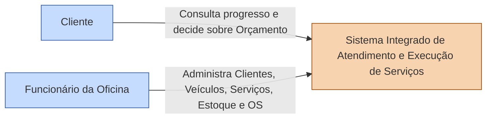
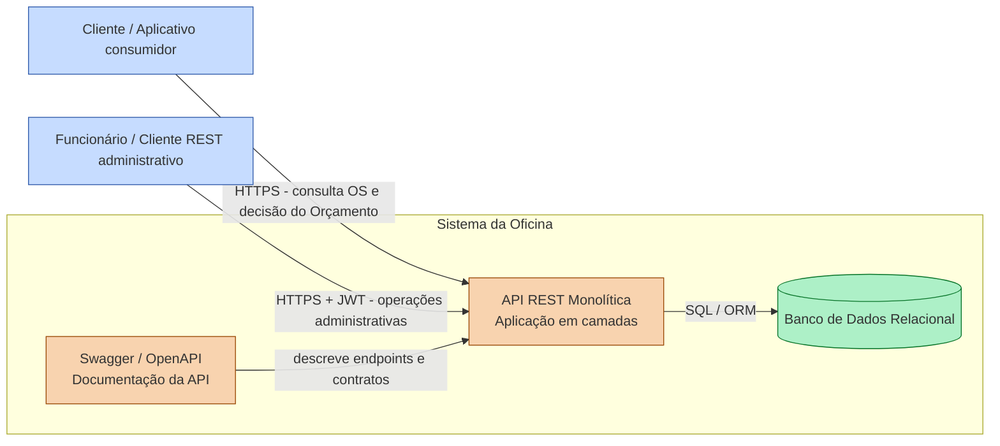
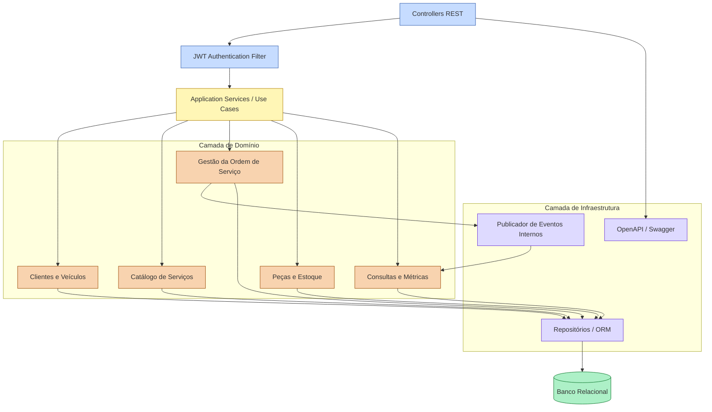

# Parte V - C4

## 16. C4 - Nível 1: Contexto do Sistema



### Responsabilidade do sistema

Centralizar o atendimento da oficina, administrar Ordens de Serviço, gerar Orçamentos, registrar decisões, controlar Peças/Insumos e disponibilizar o acompanhamento da execução.

---

## 17. C4 - Nível 2: Contêineres



### Decisões arquiteturais

- um único back-end implantável;
- API REST documentada por OpenAPI/Swagger;
- autenticação JWT apenas nas rotas administrativas;
- banco relacional recomendado pela consistência das transações e relacionamentos;
- Dockerfile para a aplicação;
- docker-compose para aplicação e banco;
- não criar broker ou microsserviços sem necessidade comprovada.

---

## 18. C4 - Nível 3: Componentes do monólito



### Dependências permitidas

```text
Interface/API -> Aplicação -> Domínio
Infraestrutura -> interfaces definidas pelas camadas internas
Domínio -> não depende de framework, banco ou API
```

---