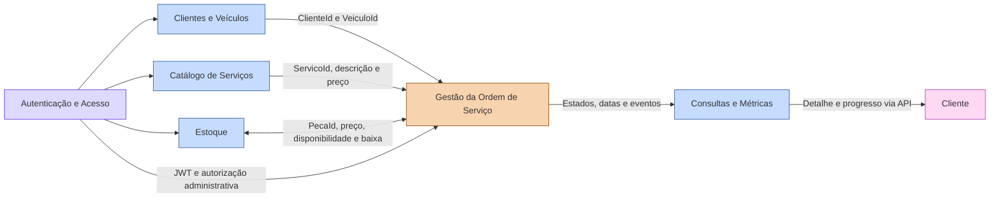
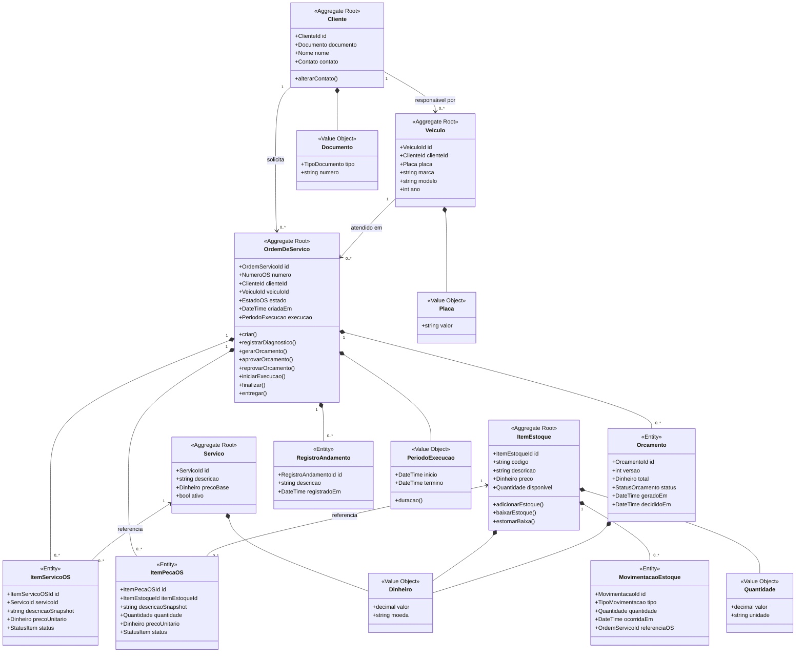
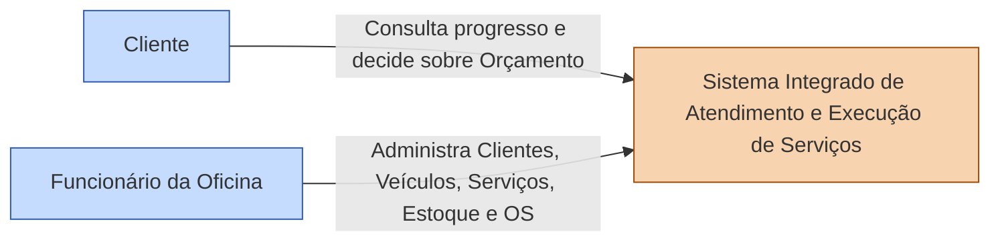
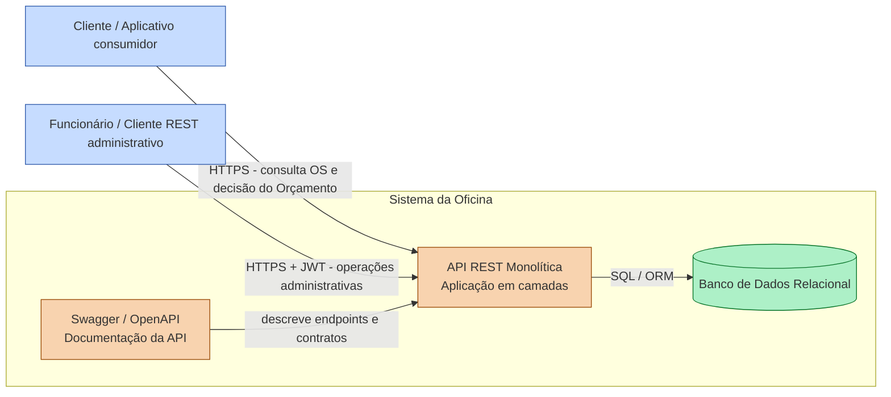
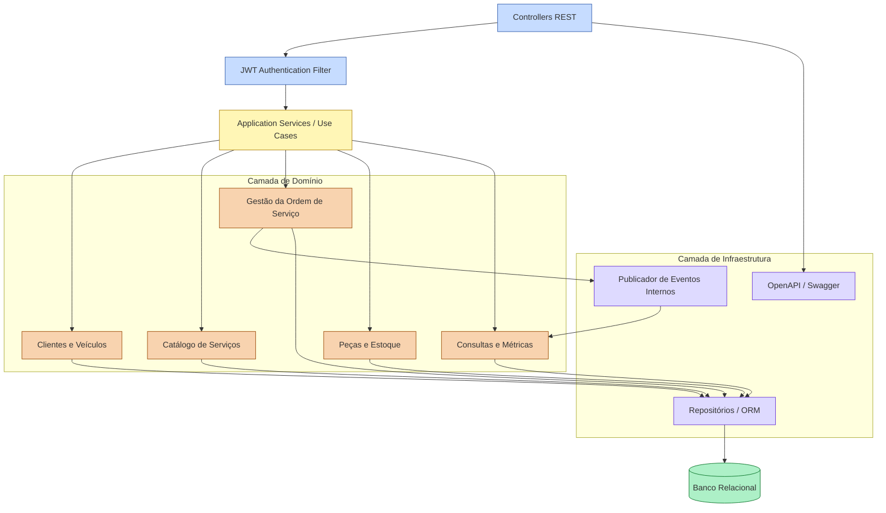

# Tech Challenge - Fase 1

## Ajustes e complementos da documentação DDD e C4

**Domínio:** oficina mecânica  
**Escopo:** MVP de back-end monolítico  
**Fontes consideradas:** frames válidos do board `Board Lil Golden Hammer`, excluindo integralmente os frames `Rascunho` e `Analise IA Fabrica`, documento `15SOAT - Fase 1 - Tech Challenge.pdf` e orientação complementar sobre os artefatos mínimos esperados.

---

## 1. Objetivo deste documento

Este documento descreve as alterações e os complementos que devem ser aplicados à documentação da Fase 1 para demonstrar:

- compreensão do domínio da oficina;
- delimitação dos principais Bounded Contexts;
- Event Storming completo dos fluxos obrigatórios;
- definição dos principais agregados, entidades, Value Objects, eventos e regras;
- aplicação consistente da Linguagem Ubíqua;
- visão arquitetural C4 compatível com um monólito em camadas;
- rastreabilidade entre requisitos, domínio e implementação.

Não é necessário criar um diagrama para cada endpoint. O conjunto deve representar as decisões estruturais e as regras centrais do domínio.

---

## 2. Escopo funcional confirmado

O MVP deve cobrir:

1. identificação e manutenção de Clientes;
2. cadastro e manutenção de Veículos;
3. cadastro de Serviços;
4. cadastro de Peças e Insumos, com controle de estoque;
5. criação da Ordem de Serviço;
6. inclusão de serviços, peças e insumos na OS;
7. elaboração automática do Orçamento;
8. envio e decisão do Cliente sobre o Orçamento;
9. diagnóstico, execução e finalização do Serviço;
10. alteração automática do estado da OS;
11. consulta do andamento pelo Cliente via API;
12. listagem e detalhamento das ordens;
13. cálculo do tempo médio de execução;
14. autenticação JWT nas APIs administrativas;
15. validação de CPF/CNPJ e placa.

### Estados oficiais da Ordem de Serviço

Os estados exigidos para a Fase 1 são:

1. `RECEBIDA`;
2. `EM_DIAGNOSTICO`;
3. `AGUARDANDO_APROVACAO`;
4. `EM_EXECUCAO`;
5. `FINALIZADA`;
6. `ENTREGUE`.

Estados auxiliares podem existir internamente, mas não devem substituir nem contradizer esse contrato funcional sem justificativa explícita.

---

## 3. Diagnóstico da documentação atual

### Pontos já atendidos

- jornada da oficina descoberta do atendimento até a entrega;
- atores Cliente, Atendente e Mecânico identificados;
- Ordem de Serviço reconhecida como elemento central;
- diagnóstico, orçamento, aprovação, estoque e execução já aparecem nos fluxos;
- problemas de priorização, estoque, acompanhamento e perda de histórico foram registrados;
- uso inicial de atores, comandos, eventos, políticas, agregados e modelos de leitura;
- estados da OS e exceções operacionais já foram levantados.

### Alterações necessárias

| Tema | Situação atual | Ajuste necessário |
|---|---|---|
| Event Storming | Ações de pessoas aparecem como eventos | Separar Ator, Comando e Evento de Domínio |
| Eventos | Alguns nomes descrevem ações no presente | Escrever eventos como fatos ocorridos, no passado |
| Políticas | Algumas políticas são apenas comandos | Representar `Evento -> Política -> Comando -> Evento` |
| Orçamento | Processo parcialmente manual | Explicitar cálculo automático baseado em Serviços, Peças e Insumos |
| Aprovação | Termos aprovação, autorização e reprovação variam | Padronizar decisão e seus efeitos sobre a OS |
| Estoque | Compra e fornecedor receberam peso superior ao requisito | Priorizar cadastro, disponibilidade, reserva e baixa do estoque |
| Contextos | Fronteiras ainda não estão formalizadas | Criar Bounded Contexts e Context Map oficiais |
| Modelo de domínio | Agregados e invariantes não estão completos | Identificar Aggregate Roots, Entidades, VOs e regras |
| Linguagem | Sinônimos e estados se confundem | Criar glossário oficial e aplicá-lo no board e no código |
| Arquitetura | Divisões podem sugerir microsserviços | Documentar monólito modular em camadas |
| Segurança | JWT não aparece na modelagem | Incluir Autenticação e Acesso como contexto genérico |
| Métricas | Tempo médio não está destacado | Criar modelo de leitura para métricas de execução |

---

# Parte I - Modelagem estratégica

## 4. Bounded Contexts propostos

Os contextos abaixo são fronteiras lógicas dentro de um monólito modular. Eles não implicam microsserviços separados.

### 4.1 Gestão da Ordem de Serviço - Core Domain

**Responsabilidades:**

- criar e acompanhar a OS;
- incluir Serviços, Peças e Insumos;
- gerar o Orçamento;
- registrar aprovação ou reprovação;
- controlar diagnóstico e execução;
- aplicar transições de estado;
- finalizar e entregar a OS.

**Modelo principal:** Ordem de Serviço.

### 4.2 Clientes e Veículos - Supporting Subdomain

**Responsabilidades:**

- cadastrar e localizar Cliente por CPF/CNPJ;
- validar documento;
- cadastrar Veículo;
- validar placa;
- associar Veículo ao Cliente responsável.

### 4.3 Catálogo de Serviços - Supporting Subdomain

**Responsabilidades:**

- cadastrar Serviços oferecidos;
- manter descrição e preço base;
- disponibilizar informações para composição do Orçamento.

### 4.4 Estoque - Supporting Subdomain

**Responsabilidades:**

- cadastrar Peças e Insumos;
- manter preço e quantidade disponível;
- verificar disponibilidade;
- reservar ou baixar itens utilizados na OS;
- impedir estoque negativo.

### 4.5 Autenticação e Acesso - Generic Subdomain

**Responsabilidades:**

- autenticar usuários administrativos;
- emitir e validar JWT;
- proteger comandos administrativos;
- aplicar perfis ou permissões quando necessário.

### 4.6 Consultas e Métricas - Supporting Subdomain

**Responsabilidades:**

- listar e detalhar ordens;
- expor o progresso da OS ao Cliente;
- fornecer modelos de leitura;
- calcular o tempo médio de execução.

---

## 5. Context Map



### Relações e contratos

| Upstream | Downstream | Contrato | Observação |
|---|---|---|---|
| Clientes e Veículos | Gestão da OS | `ClienteId`, `VeiculoId` | A OS não copia toda a entidade externa |
| Catálogo de Serviços | Gestão da OS | Serviço e preço vigente | A OS registra snapshot do item orçado |
| Estoque | Gestão da OS | disponibilidade, preço e baixa | A baixa deve ser idempotente |
| Gestão da OS | Consultas e Métricas | eventos, estado e datas | Pode usar projeções internas do monólito |
| Autenticação | APIs administrativas | JWT e permissões | Não faz parte do Core Domain |
| Consultas e Métricas | Cliente | representação pública da OS | Não expor dados administrativos sensíveis |

---

# Parte II - Event Storming

## 6. Legenda oficial

| Elemento | Uso | Convenção |
|---|---|---|
| Ator | Pessoa ou sistema que inicia uma intenção | substantivo |
| Comando | Intenção que pode ser aceita ou rejeitada | verbo no infinitivo |
| Agregado | Fronteira que protege regras | nome do Aggregate Root |
| Evento de Domínio | Fato relevante que ocorreu | verbo no passado |
| Política | Reação a um evento | quando/então |
| Modelo de Leitura | Informação preparada para consulta | nome orientado ao usuário |
| Sistema Externo | Elemento fora do domínio | nome do sistema/canal |
| Ponto de Atenção | Dúvida, risco ou decisão pendente | pergunta objetiva |

---

## 7. Event Storming - Criação e acompanhamento da OS

| Ordem | Ator | Comando | Agregado | Evento | Política ou efeito | Modelo de leitura |
|---:|---|---|---|---|---|---|
| 1 | Atendente | Identificar Cliente | Cliente | Cliente identificado | Permitir vinculação à OS | Cadastro do Cliente |
| 2 | Atendente | Cadastrar Veículo | Veículo | Veículo cadastrado | Permitir criação da OS | Dados do Veículo |
| 3 | Atendente | Criar Ordem de Serviço | OrdemDeServico | Ordem de Serviço criada | Definir estado `RECEBIDA` | Detalhe da OS |
| 4 | Atendente | Incluir Serviço solicitado | OrdemDeServico | Serviço incluído na OS | Recalcular Orçamento | Composição da OS |
| 5 | Atendente | Incluir Peça ou Insumo | OrdemDeServico | Peça ou Insumo incluído na OS | Validar item e recalcular | Composição da OS |
| 6 | Sistema | Gerar Orçamento | OrdemDeServico | Orçamento gerado | Definir estado `AGUARDANDO_APROVACAO` | Orçamento da OS |
| 7 | Sistema | Enviar Orçamento | OrdemDeServico | Orçamento enviado | Aguardar decisão do Cliente | Orçamento pendente |
| 8 | Cliente | Aprovar Orçamento | OrdemDeServico | Orçamento aprovado | Liberar execução autorizada | Situação do Orçamento |
| 9 | Cliente | Reprovar Orçamento | OrdemDeServico | Orçamento reprovado | Manter execução bloqueada | Situação do Orçamento |
| 10 | Mecânico | Iniciar Diagnóstico | OrdemDeServico | Diagnóstico iniciado | Definir estado `EM_DIAGNOSTICO` | OS em diagnóstico |
| 11 | Mecânico | Registrar Diagnóstico | OrdemDeServico | Diagnóstico registrado | Atualizar itens ou gerar nova versão do Orçamento | Diagnóstico da OS |
| 12 | Mecânico | Iniciar Execução | OrdemDeServico | Execução iniciada | Definir estado `EM_EXECUCAO` | OS em execução |
| 13 | Mecânico | Registrar Andamento | OrdemDeServico | Andamento registrado | Atualizar consulta do Cliente | Linha do tempo da OS |
| 14 | Cliente | Consultar Progresso | OrdemDeServico | Progresso consultado | Retornar visão pública | Acompanhamento da OS |

### Políticas principais

1. **Quando** a OS for criada, **então** definir o estado como `RECEBIDA`.
2. **Quando** o diagnóstico for iniciado, **então** definir `EM_DIAGNOSTICO`.
3. **Quando** o Orçamento for gerado e enviado, **então** definir `AGUARDANDO_APROVACAO`.
4. **Quando** o Orçamento for aprovado e a execução começar, **então** definir `EM_EXECUCAO`.
5. **Quando** o andamento mudar, **então** atualizar o modelo de leitura do Cliente.
6. **Quando** houver mudança de preço, Serviço, Peça ou quantidade após o envio, **então** gerar uma nova versão do Orçamento.

---

## 8. Event Storming - Elaboração, aprovação ou reprovação do Orçamento

| Ordem | Ator | Comando | Agregado | Evento | Regra |
|---:|---|---|---|---|---|
| 1 | Atendente | Adicionar Serviço | OrdemDeServico | Serviço adicionado | Serviço precisa existir no Catálogo |
| 2 | Atendente | Adicionar Peça ou Insumo | OrdemDeServico | Item de Estoque adicionado | Item precisa existir e possuir preço válido |
| 3 | Sistema | Calcular Orçamento | OrdemDeServico | Orçamento calculado | Total = serviços + peças + insumos |
| 4 | Sistema | Criar Versão do Orçamento | OrdemDeServico | Versão do Orçamento criada | Versão enviada torna-se imutável |
| 5 | Sistema/Atendente | Enviar Orçamento | OrdemDeServico | Orçamento enviado | Registrar data e versão |
| 6 | Cliente | Aprovar Orçamento | OrdemDeServico | Orçamento aprovado | Apenas a versão vigente pode ser aprovada |
| 7 | Cliente | Reprovar Orçamento | OrdemDeServico | Orçamento reprovado | A execução permanece bloqueada |
| 8 | Mecânico | Identificar Serviço adicional | OrdemDeServico | Serviço adicional identificado | Exigir novo Orçamento e nova decisão |
| 9 | Sistema | Recalcular Orçamento | OrdemDeServico | Orçamento recalculado | Criar nova versão; não sobrescrever a aprovada |

### Regras do Orçamento

- o total é calculado automaticamente;
- cada item registra descrição, quantidade, preço unitário e subtotal;
- uma versão enviada não deve ser alterada retroativamente;
- somente uma versão vigente pode receber decisão;
- execução de item adicional exige aprovação explícita;
- aprovação e reprovação registram data e versão;
- reprovação não significa automaticamente que a OS foi entregue ou encerrada.

---

## 9. Event Storming - Execução e finalização do Serviço

| Ordem | Ator | Comando | Agregado | Evento | Política ou efeito |
|---:|---|---|---|---|---|
| 1 | Mecânico | Iniciar Diagnóstico | OrdemDeServico | Diagnóstico iniciado | Estado `EM_DIAGNOSTICO` |
| 2 | Mecânico | Registrar Diagnóstico | OrdemDeServico | Diagnóstico registrado | Atualizar escopo/orçamento se necessário |
| 3 | Mecânico | Iniciar Execução | OrdemDeServico | Execução iniciada | Exigir Orçamento aprovado; estado `EM_EXECUCAO` |
| 4 | Mecânico | Consumir Peça | OrdemDeServico/Estoque | Peça consumida | Baixar estoque de forma idempotente |
| 5 | Mecânico | Registrar Andamento | OrdemDeServico | Andamento registrado | Atualizar acompanhamento |
| 6 | Mecânico | Finalizar Serviço | OrdemDeServico | Serviço finalizado | Verificar se todos os itens autorizados terminaram |
| 7 | Sistema/Mecânico | Finalizar Ordem de Serviço | OrdemDeServico | Ordem de Serviço finalizada | Estado `FINALIZADA`; registrar término |
| 8 | Atendente | Entregar Veículo | OrdemDeServico | Veículo entregue | Estado `ENTREGUE`; registrar data da entrega |

### Invariantes de execução

- não iniciar execução sem Orçamento aprovado;
- não executar item que não pertence à versão aprovada;
- não baixar a mesma Peça duas vezes para a mesma operação;
- uma OS só pode ser `FINALIZADA` quando todos os itens autorizados estiverem concluídos;
- `FINALIZADA` e `ENTREGUE` são fatos distintos;
- o tempo de execução é calculado a partir das datas de início e término.

---

## 10. Event Storming - Gestão de Peças e Insumos

| Ordem | Ator | Comando | Agregado | Evento | Regra ou efeito |
|---:|---|---|---|---|---|
| 1 | Administrador | Cadastrar Peça ou Insumo | ItemEstoque | Item de Estoque cadastrado | Código e descrição obrigatórios |
| 2 | Administrador | Alterar Preço | ItemEstoque | Preço do item alterado | Novo preço não altera Orçamentos já enviados |
| 3 | Administrador | Adicionar Estoque | ItemEstoque | Estoque adicionado | Quantidade positiva |
| 4 | Atendente | Consultar Disponibilidade | ItemEstoque | Disponibilidade consultada | Retornar saldo atual |
| 5 | Atendente | Incluir Item na OS | OrdemDeServico | Item de Estoque incluído na OS | Registrar snapshot de preço |
| 6 | Sistema | Reservar Quantidade | ItemEstoque | Quantidade reservada | Impedir reserva superior ao disponível |
| 7 | Mecânico | Consumir Quantidade | ItemEstoque | Estoque baixado | Impedir saldo negativo e duplicidade |
| 8 | Sistema/Administrador | Estornar Baixa | ItemEstoque | Baixa de Estoque estornada | Exigir referência da movimentação original |

### Pontos de atenção

- definir se a reserva é obrigatória no MVP ou se a baixa ocorre apenas no consumo;
- definir o momento exato da baixa: aprovação, início ou consumo;
- definir comportamento quando não houver quantidade suficiente;
- registrar histórico de movimentações para auditoria;
- usar controle de concorrência para evitar saldo negativo.

---

# Parte III - Modelo de domínio

## 11. Visão geral dos agregados

| Aggregate Root | Entidades internas | Value Objects principais | Eventos principais |
|---|---|---|---|
| Cliente | - | Documento, Nome, Contato | ClienteCadastrado, ClienteAtualizado |
| Veiculo | - | Placa, MarcaModelo, Ano | VeiculoCadastrado, VeiculoAtualizado |
| Servico | - | DescricaoServico, Dinheiro | ServicoCadastrado, PrecoServicoAlterado |
| ItemEstoque | MovimentacaoEstoque | CodigoItem, Quantidade, Dinheiro | ItemCadastrado, EstoqueAdicionado, EstoqueBaixado |
| OrdemDeServico | ItemServicoOS, ItemPecaOS, Orcamento, RegistroAndamento | NumeroOS, Dinheiro, PeriodoExecucao, Diagnostico, EstadoOS | OSCriada, OrcamentoGerado, OrcamentoAprovado, ExecucaoIniciada, OSFinalizada, OSEntregue |

---

## 12. Diagrama do modelo de domínio



### Decisões de modelagem

- `OrdemDeServico` é o Aggregate Root central e controla suas transições;
- `Orcamento` é entidade interna da OS e possui versões;
- itens da OS mantêm snapshot de descrição e preço para preservar histórico;
- `Cliente`, `Veiculo`, `Servico` e `ItemEstoque` são agregados independentes e são referenciados por identidade;
- baixa de estoque ocorre dentro de `ItemEstoque`, não diretamente dentro da OS;
- integrações entre agregados são coordenadas pela camada de aplicação;
- consistência forte é garantida dentro de cada agregado;
- uma única transação não deve carregar todo o grafo de Clientes, Veículos, Serviços, Estoque e OS.

---

## 13. Regras e invariantes do domínio

### Ordem de Serviço

1. Uma OS deve possuir Cliente e Veículo válidos.
2. Uma OS nasce no estado `RECEBIDA`.
3. O Orçamento deve ser calculado com base nos itens atuais.
4. Uma versão enviada do Orçamento é imutável.
5. A execução só pode começar após aprovação do Orçamento vigente.
6. Mudança de escopo ou preço após envio cria nova versão.
7. A OS só pode ser finalizada quando os itens autorizados estiverem concluídos.
8. A entrega só ocorre após a finalização.
9. Toda transição de estado registra data e causa.
10. Finalização e entrega são eventos distintos.

### Estoque

1. A quantidade disponível nunca pode ser negativa.
2. Toda baixa deve gerar uma movimentação.
3. Repetição do mesmo comando não pode duplicar a baixa.
4. Estorno deve referenciar a movimentação original.
5. Alteração de preço não modifica Orçamentos já enviados.

### Cliente e Veículo

1. CPF/CNPJ deve ser válido.
2. Documento deve respeitar a unicidade definida pelo negócio.
3. Placa deve possuir formato válido.
4. Veículo deve estar associado a um Cliente responsável.

---

## 14. Eventos de Domínio prioritários

- `ClienteCadastrado`;
- `VeiculoCadastrado`;
- `OrdemDeServicoCriada`;
- `ServicoAdicionadoNaOS`;
- `PecaAdicionadaNaOS`;
- `OrcamentoGerado`;
- `OrcamentoEnviado`;
- `OrcamentoAprovado`;
- `OrcamentoReprovado`;
- `DiagnosticoIniciado`;
- `DiagnosticoRegistrado`;
- `ExecucaoIniciada`;
- `AndamentoRegistrado`;
- `PecaConsumida`;
- `OrdemDeServicoFinalizada`;
- `VeiculoEntregue`;
- `EstoqueAdicionado`;
- `EstoqueBaixado`;
- `BaixaDeEstoqueEstornada`.

Esses eventos podem ser objetos internos do monólito. A Fase 1 não exige mensageria distribuída.

---

# Parte IV - Linguagem Ubíqua

## 15. Glossário oficial

| Termo | Significado no domínio | Não confundir com |
|---|---|---|
| Cliente | Pessoa física ou jurídica responsável pelo atendimento | Usuário administrativo |
| Documento | CPF ou CNPJ usado para identificar o Cliente | Identificador interno |
| Veículo | Bem atendido pela oficina | Ordem de Serviço |
| Placa | Identificação validada do Veículo | Código interno |
| Serviço | Tipo de trabalho oferecido pela oficina | Execução de uma OS específica |
| Peça | Componente aplicado ao Veículo | Serviço ou mão de obra |
| Insumo | Material consumido na execução | Peça rastreável, quando houver distinção |
| Item de Estoque | Peça ou Insumo administrado pelo estoque | Item já incluído na OS |
| Ordem de Serviço | Agregado que representa o atendimento operacional do Veículo | Orçamento |
| Item de Serviço da OS | Serviço específico incluído na OS | Serviço do Catálogo |
| Item de Peça da OS | Snapshot de Peça/Insumo incluído na OS | Cadastro atual do Estoque |
| Diagnóstico | Conclusão técnica registrada pelo Mecânico | Reclamação informada pelo Cliente |
| Orçamento | Composição financeira versionada da OS | Aprovação |
| Versão do Orçamento | Conteúdo imutável enviado ao Cliente | Rascunho em edição |
| Aprovação | Decisão positiva do Cliente sobre o Orçamento vigente | Envio do Orçamento |
| Reprovação | Decisão negativa do Cliente sobre o Orçamento | Falha técnica do Serviço |
| Execução | Realização dos itens autorizados | Diagnóstico |
| Andamento | Registro cronológico do progresso | Estado oficial da OS |
| OS Recebida | OS criada e aceita para atendimento | Veículo entregue |
| Em diagnóstico | Diagnóstico técnico em andamento | Em execução |
| Aguardando aprovação | Orçamento enviado e decisão pendente | Orçamento aprovado |
| Em execução | Serviços autorizados em realização | Finalizada |
| Finalizada | Trabalho autorizado concluído | Entregue |
| Entregue | Veículo devolvido ao Cliente | Finalizada |
| Estoque disponível | Quantidade que pode ser utilizada | Quantidade histórica |
| Baixa de Estoque | Redução confirmada por consumo/uso | Consulta ou inclusão na OS |
| Tempo de execução | Intervalo entre início e término da execução | Tempo total desde a criação da OS |

### Convenções de nomenclatura

- comandos: verbo no infinitivo, como `AprovarOrcamento`;
- eventos: fato no passado, como `OrcamentoAprovado`;
- consultas: substantivo orientado à informação, como `DetalheDaOS`;
- evitar comandos genéricos como `AtualizarStatus` quando o fato de negócio puder ser nomeado;
- usar os mesmos termos no Miro, código, Swagger, testes e README.

---

# Parte V - C4

## 16. C4 - Nível 1: Contexto do Sistema



### Responsabilidade do sistema

Centralizar o atendimento da oficina, administrar Ordens de Serviço, gerar Orçamentos, registrar decisões, controlar Peças/Insumos e disponibilizar o acompanhamento da execução.

---

## 17. C4 - Nível 2: Contêineres



### Decisões arquiteturais

- um único back-end implantável;
- API REST documentada por OpenAPI/Swagger;
- autenticação JWT apenas nas rotas administrativas;
- banco relacional recomendado pela consistência das transações e relacionamentos;
- Dockerfile para a aplicação;
- docker-compose para aplicação e banco;
- não criar broker ou microsserviços sem necessidade comprovada.

---

## 18. C4 - Nível 3: Componentes do monólito



### Dependências permitidas

```text
Interface/API -> Aplicação -> Domínio
Infraestrutura -> interfaces definidas pelas camadas internas
Domínio -> não depende de framework, banco ou API
```

---

# Parte VI - Implementação

## 19. Casos de uso prioritários

### Clientes e Veículos

- `CriarCliente`;
- `AtualizarCliente`;
- `ConsultarClientePorDocumento`;
- `CadastrarVeiculo`;
- `AtualizarVeiculo`;
- `ListarVeiculosDoCliente`.

### Catálogo e Estoque

- `CadastrarServico`;
- `AtualizarServico`;
- `CadastrarItemEstoque`;
- `AdicionarEstoque`;
- `BaixarEstoque`;
- `ConsultarDisponibilidade`;
- `ListarMovimentacoes`.

### Ordem de Serviço

- `CriarOrdemDeServico`;
- `AdicionarServicoNaOS`;
- `AdicionarPecaNaOS`;
- `GerarOrcamento`;
- `EnviarOrcamento`;
- `AprovarOrcamento`;
- `ReprovarOrcamento`;
- `IniciarDiagnostico`;
- `RegistrarDiagnostico`;
- `IniciarExecucao`;
- `RegistrarAndamento`;
- `FinalizarOS`;
- `EntregarVeiculo`;
- `ConsultarProgressoDaOS`.

### Consultas e Métricas

- `ListarOrdensDeServico`;
- `DetalharOrdemDeServico`;
- `ConsultarOSParaCliente`;
- `CalcularTempoMedioDeExecucao`.

---

## 20. Endpoints REST sugeridos

Os endpoints não substituem o modelo de domínio; são apenas interfaces para os casos de uso.

```text
POST   /clientes
GET    /clientes/{id}
GET    /clientes/documento/{cpfCnpj}
PUT    /clientes/{id}

POST   /veiculos
GET    /veiculos/{id}
PUT    /veiculos/{id}

POST   /servicos
GET    /servicos
PUT    /servicos/{id}

POST   /itens-estoque
GET    /itens-estoque
PUT    /itens-estoque/{id}
POST   /itens-estoque/{id}/entradas
POST   /itens-estoque/{id}/baixas

POST   /ordens-servico
GET    /ordens-servico
GET    /ordens-servico/{id}
POST   /ordens-servico/{id}/servicos
POST   /ordens-servico/{id}/pecas
POST   /ordens-servico/{id}/orcamentos
POST   /ordens-servico/{id}/orcamentos/{versao}/aprovar
POST   /ordens-servico/{id}/orcamentos/{versao}/reprovar
POST   /ordens-servico/{id}/diagnostico/iniciar
POST   /ordens-servico/{id}/diagnostico
POST   /ordens-servico/{id}/execucao/iniciar
POST   /ordens-servico/{id}/andamentos
POST   /ordens-servico/{id}/finalizar
POST   /ordens-servico/{id}/entregar

GET    /publico/ordens-servico/{codigoAcompanhamento}
GET    /metricas/tempo-medio-execucao
```

### Segurança

- rotas administrativas exigem JWT;
- consulta pública utiliza identificador não sequencial e dados mínimos;
- não expor CPF/CNPJ completo na consulta pública;
- validar autorização antes de qualquer alteração;
- registrar falhas de autenticação e operações sensíveis.

---

## 21. Persistência sugerida

### Banco relacional

É adequado ao MVP porque:

- há relacionamentos claros entre Cliente, Veículo e OS;
- Orçamento e itens exigem consistência transacional;
- estoque exige controle concorrente;
- consultas administrativas e métricas são estruturadas;
- suporte a migrations, índices, constraints e locks facilita a integridade.

### Tabelas conceituais

- `clientes`;
- `veiculos`;
- `servicos`;
- `itens_estoque`;
- `movimentacoes_estoque`;
- `ordens_servico`;
- `itens_servico_os`;
- `itens_peca_os`;
- `orcamentos`;
- `registros_andamento`;
- `usuarios_administrativos`.

### Constraints essenciais

- unicidade do documento do Cliente conforme regra definida;
- unicidade da placa;
- quantidade de estoque maior ou igual a zero;
- versão única do Orçamento por OS;
- valores monetários não negativos;
- integridade referencial entre entidades;
- índice para documento, placa, estado da OS e datas de execução.

---

## 22. Estratégia de testes

### Domínios críticos

Priorizar cobertura de:

- transições da OS;
- cálculo e versionamento do Orçamento;
- aprovação e reprovação;
- bloqueio de execução sem aprovação;
- baixa e estorno de estoque;
- concorrência no estoque;
- validação de CPF/CNPJ e placa;
- cálculo do tempo médio.

### Pirâmide sugerida

1. **Testes unitários:** agregados, VOs, políticas e cálculos.
2. **Testes de aplicação:** casos de uso e coordenação entre repositórios.
3. **Testes de integração:** banco, API REST, JWT e transações.
4. **Testes de contrato:** payloads documentados no Swagger.

Meta: cobertura mínima de 80% nos domínios críticos, sem usar cobertura como substituto de qualidade dos cenários.

---

## 23. Observabilidade e segurança

### Logs estruturados

Registrar:

- `correlationId`;
- `ordemServicoId` quando aplicável;
- caso de uso executado;
- resultado;
- tempo de execução;
- falha de validação;
- tentativa de acesso não autorizado.

Não registrar CPF/CNPJ completo, token JWT ou dados sensíveis em texto puro.

### Scan de vulnerabilidades

O relatório deve apresentar:

- ferramenta utilizada;
- data do scan;
- dependências e código analisados;
- vulnerabilidades por severidade;
- falsos positivos justificados;
- plano de correção;
- riscos aceitos e responsáveis.

---

# Parte VII - Plano de atualização da documentação

## 24. Organização recomendada da prancha DDD

Uma única prancha pode conter as seguintes áreas, nesta ordem:

1. **Escopo e legenda**;
2. **Event Storming - Criação e acompanhamento da OS**;
3. **Event Storming - Orçamento**;
4. **Event Storming - Execução e finalização**;
5. **Event Storming - Peças e Insumos**;
6. **Bounded Contexts e Context Map**;
7. **Modelo de domínio**;
8. **Linguagem Ubíqua**;
9. **C4 - Contexto, Contêineres e Componentes**;
10. **Decisões, dúvidas e itens futuros**.

### Padrão visual do Event Storming

- Ator: amarelo;
- Comando: azul;
- Evento: laranja;
- Agregado: cinza;
- Política: roxo;
- Modelo de Leitura: verde;
- Sistema Externo/Ponto de Atenção: rosa/vermelho;
- cada fluxo deve ser lido da esquerda para a direita;
- decisões e exceções devem permanecer próximas do evento que as provoca.

---

## 25. Backlog priorizado

### P0 - Obrigatório para a entrega

- corrigir Event Storming conforme os quatro fluxos;
- validar os seis estados oficiais da OS;
- criar Context Map e Bounded Contexts;
- criar diagrama do modelo de domínio;
- validar Aggregate Roots e invariantes;
- consolidar Linguagem Ubíqua;
- adicionar C4 Contexto, Contêineres e Componentes;
- alinhar nomes entre documentação e código.

### P1 - Implementação do Core Domain

- implementar `OrdemDeServico` e transições;
- implementar cálculo/versionamento do Orçamento;
- implementar decisão do Cliente;
- implementar controle de estoque;
- implementar eventos internos;
- implementar modelos de leitura.

### P2 - Infraestrutura e qualidade

- banco e migrations;
- JWT;
- Swagger;
- Dockerfile e docker-compose;
- validações;
- testes e cobertura;
- logs e tratamento de erros.

### P3 - Entrega

- README;
- relatório de vulnerabilidades;
- vídeo de demonstração;
- PDF final com participantes e links;
- conceder acesso ao repositório privado.

---

## 26. Definition of Done da documentação DDD

Um fluxo está documentado quando:

- usa termos do glossário;
- identifica Ator, Comando, Agregado e Evento;
- apresenta políticas e exceções relevantes;
- pertence a um Bounded Context definido;
- aponta o Aggregate Root responsável;
- explicita invariantes;
- identifica modelos de leitura afetados;
- está rastreado para um requisito do Tech Challenge;
- usa a mesma nomenclatura do código, Swagger e testes;
- foi validado pelo grupo.

---

## 27. Checklist final da Fase 1

### Documentação DDD

- [ ] Event Storming - criação e acompanhamento da OS.
- [ ] Event Storming - elaboração, aprovação e reprovação do Orçamento.
- [ ] Event Storming - execução e finalização.
- [ ] Event Storming - Peças e Insumos.
- [ ] Context Map.
- [ ] Bounded Contexts.
- [ ] Diagrama de agregados, entidades e Value Objects.
- [ ] Principais eventos e regras.
- [ ] Linguagem Ubíqua.
- [ ] C4 Contexto.
- [ ] C4 Contêineres.
- [ ] C4 Componentes.

### Código e ambiente

- [ ] APIs REST implementadas.
- [ ] Swagger/OpenAPI.
- [ ] JWT administrativo.
- [ ] Validação de CPF/CNPJ e placa.
- [ ] Banco justificado.
- [ ] Dockerfile.
- [ ] docker-compose.
- [ ] README de execução local.
- [ ] Testes unitários.
- [ ] Testes de integração.
- [ ] Cobertura mínima de 80% nos domínios críticos.

### Entrega

- [ ] Repositório privado acessível ao usuário solicitado.
- [ ] Scan e relatório de vulnerabilidades.
- [ ] Vídeo de até 15 minutos.
- [ ] Documento final com grupo, participantes e links.

---

## 28. Itens fora do escopo obrigatório

Podem ser apresentados como evolução futura, sem ampliar o MVP:

- integração automática com fornecedores;
- pagamentos;
- emissão fiscal;
- garantia e retrabalho avançados;
- notificações por múltiplos canais;
- microsserviços;
- mensageria distribuída;
- aplicativo do Cliente completo;
- inteligência artificial ou previsão de manutenção.

Esses itens não devem competir com a implementação dos fluxos obrigatórios.

