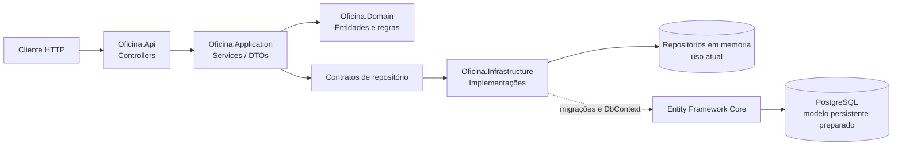
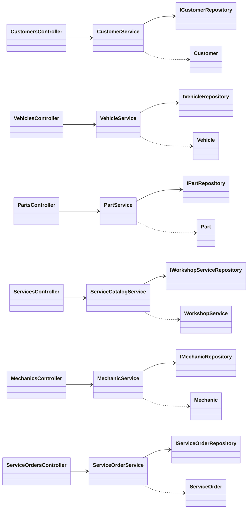
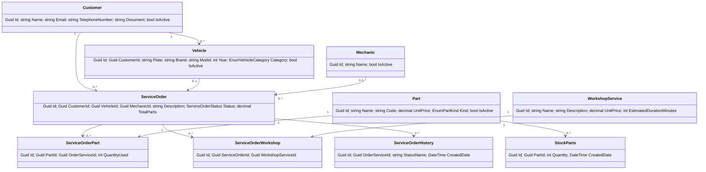

# Contexto geral da aplicação

## 1. Visão geral

O projeto Oficina API é um MVP RESTful para apoiar a operação de uma oficina mecânica. A aplicação permite cadastrar clientes, veículos, peças, serviços oferecidos, mecânicos e ordens de serviço. Também contempla controle inicial de peças utilizadas e histórico de status de ordens.

O código está organizado em uma solução .NET 10 com separação por responsabilidades:

- `Oficina.Domain`: entidades, enums e regras de negócio;
- `Oficina.Application`: casos de uso, DTOs, paginação e contratos de repositório;
- `Oficina.Infrastructure`: Entity Framework Core, PostgreSQL, migrations e implementações de persistência;
- `Oficina.Api`: controllers HTTP, Swagger, health check e tratamento de exceções;
- `Oficina.Tests`: testes unitários de domínio, aplicação e modelo do EF.

## 2. Arquitetura e fluxo de execução

Uma requisição chega a um controller, é convertida em um caso de uso da camada Application, que valida e altera entidades do domínio. A persistência é abstraída por interfaces. Atualmente, a maioria dos contratos está registrada para implementações `InMemory...`; o `AppDbContext` e o PostgreSQL estão preparados, mas ainda não são o caminho efetivo desses casos de uso.

## 3. Diagrama de classes da aplicação

O domínio mantém invariantes como validação de CPF/CNPJ, placa, valores, quantidades e transições básicas da ordem. DTOs evitam que os contratos HTTP dependam diretamente dos objetos de entrada internos. A API usa `Problem+JSON` para erros tratados: 400 para argumentos/operações inválidas, 404 para recursos ausentes, 409 para conflitos e 500 para erros não previstos.

## 4. Modelo de dados e Entity Framework Core

O `AppDbContext` declara entidades para clientes, veículos, peças, ordens, mecânicos, serviços de oficina, itens de ordem, histórico e estoque. O mapeamento define chaves, relacionamentos, obrigatoriedade, tamanhos máximos, enumerações armazenadas como texto e valores monetários como `decimal(18,2)`.

### Escolha do PostgreSQL

PostgreSQL é adequado ao domínio porque oferece modelo relacional consistente para vínculos entre cliente, veículo e ordem, transações para operações de estoque, índices únicos para documentos/placas/códigos e bom suporte a aplicações containerizadas. A versão definida no Compose é PostgreSQL 16. O banco também permite evoluir o MVP para consultas, relatórios e auditoria sem abandonar integridade referencial.

### Escolha do Entity Framework Core

O EF Core foi escolhido por integrar-se naturalmente ao .NET, permitir mapeamento por código, migrations versionadas e uso de LINQ com tipagem. O provider `Npgsql.EntityFrameworkCore.PostgreSQL` traduz o modelo para PostgreSQL. No estado atual, essa infraestrutura está parcialmente implantada: o contexto e migrations existem, porém a injeção de dependência ainda seleciona repositórios em memória para clientes, veículos, peças, serviços e ordens.

## 5. Endpoints

Todos os endpoints abaixo usam prefixo `/api` e GUIDs nos recursos individuais.

| Recurso | Operações |
|---|---|
| `/customers` | `GET`, `GET /{id}`, `POST`, `PUT /{id}`, `DELETE /{id}` |
| `/vehicles` | `GET` com filtro opcional `customerId`, `GET /{id}`, `POST`, `POST /identify-customer-and-register`, `PUT /{id}`, `DELETE /{id}` |
| `/parts` | `GET`, `GET /{id}`, `POST`, `PUT /{id}`, `POST /{id}/stock-adjustments`, `DELETE /{id}` |
| `/workshop-services` | `GET`, `GET /{id}`, `POST`, `PUT /{id}`, `DELETE /{id}` |
| `/mechanics` | `GET`, `GET /{id}`, `POST`, `PUT /{id}`, `DELETE /{id}` |
| `/service-orders` | `GET`, `GET /{id}`, `POST`, `POST /{id}/parts` |
| `/health` | Health check da API |

Listagens de cadastros usam `PageRequest` e retornam `PagedResponse`. Criações respondem 201, exclusões bem-sucedidas respondem 204 e consultas inexistentes respondem 404.

## 6. Swagger

O Swagger é habilitado pelo `AddSwaggerGen`, com documento `v1` intitulado `Oficina API`. A interface fica em `/swagger` e o JSON em `/swagger/v1/swagger.json`. Os controllers usam atributos `ProducesResponseType`, portanto os principais códigos HTTP ficam descritos no contrato gerado.

## 7. Execução

Com Docker, `docker compose up --build` inicia a API na porta 8080 e PostgreSQL na 5432. A connection string usa `ConnectionStrings__Database`. Antes de usar PostgreSQL em produção, a aplicação precisa executar migrations e trocar os registros `InMemory...` por repositórios baseados em `AppDbContext`.
