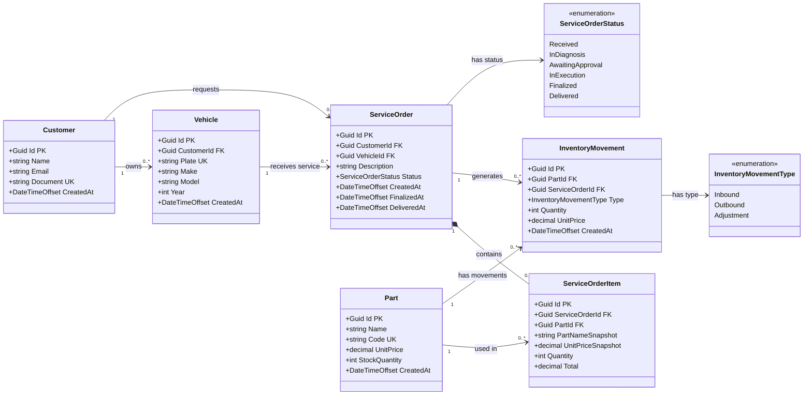

# Diagrama de classes do banco de dados

O modelo abaixo representa a estrutura relacional recomendada para o PostgreSQL.
Apesar do formato de diagrama de classes, cada classe representa uma tabela.

## Regras de integridade

- `Customer.Id`, `Vehicle.Id`, `ServiceOrder.Id`, `ServiceOrderItem.Id` e `Part.Id` são chaves primárias.
- `Vehicle.CustomerId` referencia `Customer.Id`.
- `ServiceOrder.VehicleId` referencia `Vehicle.Id`.
- `ServiceOrder.CustomerId` referencia `Customer.Id`.
- O par `(CustomerId, VehicleId)` da ordem deve ser validado para garantir que o veículo pertence ao cliente.
- `ServiceOrderItem.ServiceOrderId` referencia `ServiceOrder.Id` com exclusão em cascata.
- `ServiceOrderItem.PartId` referencia `Part.Id`; a peça não deve ser excluída se já estiver no histórico.
- `Document`, `Plate` e `Code` devem possuir índice único após normalização.
- `UnitPrice`, `UnitPriceSnapshot` e `Total` não podem ser negativos.
- `Quantity` e `StockQuantity` não podem ser negativos; a quantidade de um item deve ser maior que zero.
- A baixa de estoque e a inclusão do item da ordem devem ocorrer na mesma transação.

## Observações de modelagem

`Vehicle` deve ter um identificador próprio. Assim, uma ordem de serviço fica associada ao veículo específico, e não apenas ao proprietário.

`ServiceOrderItem` mantém o nome e o preço da peça no momento da utilização. Isso preserva o histórico mesmo que o cadastro da peça seja alterado posteriormente.

`InventoryMovement` é recomendado para auditoria do estoque. `Part.StockQuantity` pode ser mantido como saldo atual, enquanto os movimentos registram entradas, saídas e ajustes.
