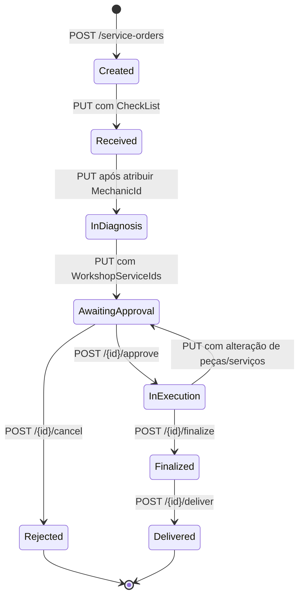
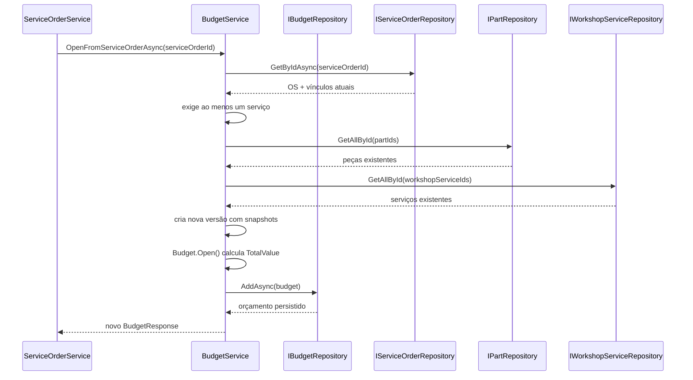
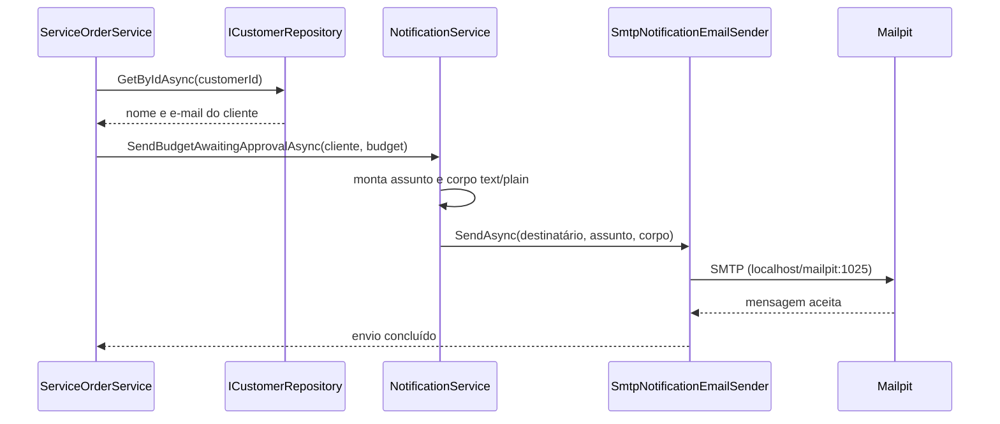

# Fluxo da Ordem de Serviço

> Atualizado em 29/08/2026: toda entrada real em `AwaitingApproval` cria uma nova
> versão de `Budget` e envia suas informações por e-mail ao cliente. Isso inclui a
> reaprovação provocada por alterações de peças ou serviços em uma OS `InExecution`.
> O envio é síncrono, em texto simples, por meio da infraestrutura SMTP configurada
> para o Mailpit no ambiente de desenvolvimento.

## Fluxo de orçamento e notificação implementado

```text
InDiagnosis -> AwaitingApproval
InExecution -- alteração de peças/serviços --> AwaitingApproval
  -> persiste a OS e o histórico AwaitingApproval
  -> cria um novo Budget para a composição atual
  -> persiste snapshots de nome, quantidade e preço
  -> carrega nome e e-mail do cliente
  -> monta assunto e corpo em texto simples
  -> envia imediatamente pelo SMTP/Mailpit
```

- `Budgets(ServiceOrderId)` possui índice não único e mantém as versões anteriores.
- `BudgetRepository.GetByServiceOrderIdAsync()` retorna o orçamento mais recente,
  ordenado por `CreatedAt` e, em caso de empate, por `Id`.
- O e-mail é enviado somente quando ocorre a transição real para
  `AwaitingApproval`; alterações posteriores enquanto a OS já está nesse status não
  criam outro orçamento nem disparam outro envio.
- Aprovação e rejeição atualizam `IsApproved` somente no orçamento mais recente.
- Não há outbox, worker ou retry automático: a chamada HTTP aguarda o SMTP.
- O corpo usa os snapshots do budget e `IsBodyHtml = false`.

## 1. Objetivo e escopo

Este documento descreve o fluxo implementado para uma Ordem de Serviço (OS), desde sua abertura até a entrega ou rejeição. A análise cobre:

- endpoints HTTP;
- regras e mudanças de status;
- atualização de checklist, mecânico, peças e serviços de oficina;
- movimentação de estoque;
- histórico de status;
- criação e consulta de orçamento (`Budget`);
- envio automático das informações do budget por e-mail;
- agenda e métricas derivadas da OS;
- persistência e tratamento de erros;
- lacunas e riscos identificados no código atual.

O ponto de entrada principal é `src/Oficina.Api/Controllers/ServiceOrdersController.cs`. A regra de aplicação está em `src/Oficina.Application/OrdensServico/ServiceOrderService.cs`, e a máquina de estados está em `src/Oficina.Domain/OrderService/ServiceOrder.cs`.

## 2. Visão arquitetural

O fluxo atravessa quatro camadas:

```text
Cliente HTTP
  -> ServiceOrdersController
  -> ServiceOrderService
  -> entidades e regras de domínio
  -> repositórios
  -> Entity Framework Core / PostgreSQL
```

Responsabilidades:

| Camada | Responsabilidade |
|---|---|
| API | Define rotas, autenticação e códigos de sucesso. Encaminha chamadas para a aplicação. |
| Application | Orquestra entidades, consultas, estoque, histórico e persistência. |
| Domain | Valida a OS e decide suas transições de status. |
| Infrastructure | Consulta e grava a OS e suas relações por Entity Framework Core. |

`ServiceOrderService` depende de sete repositórios e de dois serviços de aplicação:

- `IServiceOrderRepository`;
- `ICustomerRepository`;
- `IVehicleRepository`;
- `IPartRepository`;
- `IWorkshopServiceRepository`;
- `IStockRepository`;
- `IServiceOrderHistoryRepository`;
- `IBudgetService`;
- `NotificationService`.

Não há chamada HTTP entre microsserviços nesse fluxo. As “interações com outros services” são chamadas entre serviços/repositórios do mesmo monólito e usam o mesmo banco PostgreSQL.

## 3. Endpoints da Ordem de Serviço

Todos os endpoints de `ServiceOrdersController` exigem JWT por meio do atributo `[Authorize]`. A rota-base é `/api/v1/service-orders`.

| Método e rota | Ação | Resultado de sucesso |
|---|---|---|
| `GET /api/v1/service-orders` | Lista todas as OSs | `200 OK` com itens resumidos |
| `GET /api/v1/service-orders/{id}` | Obtém uma OS completa | `200 OK` ou `404 Not Found` |
| `POST /api/v1/service-orders` | Abre uma OS | `201 Created` |
| `PUT /api/v1/service-orders` | Atualiza dados, avança o fluxo ou solicita reaprovação | `200 OK` |
| `POST /api/v1/service-orders/{id}/approve` | Aprova a OS aguardando decisão | `200 OK` |
| `POST /api/v1/service-orders/{id}/cancel` | Rejeita a OS aguardando decisão | `200 OK` |
| `POST /api/v1/service-orders/{id}/finalize` | Finaliza uma OS em execução | `200 OK` |
| `POST /api/v1/service-orders/{id}/deliver` | Entrega uma OS finalizada | `200 OK` |

O `PUT` não recebe o identificador na URL. O `ServiceOrderId` faz parte de `UpdateServiceOrderRequest`.

### Contratos principais

Para abrir uma OS:

```json
{
  "customerId": "guid",
  "vehicleId": "guid",
  "description": "Descrição do problema ou serviço solicitado"
}
```

Para atualizar uma OS:

```json
{
  "serviceOrderId": "guid",
  "mechanicId": "guid ou null",
  "description": "texto opcional",
  "checkList": "texto opcional",
  "parts": [
    {
      "partId": "guid",
      "quantity": 1
    }
  ],
  "workshopServiceIds": ["guid"]
}
```

Na atualização, propriedades omitidas chegam como `null` e preservam o valor atual. Quando `Parts` ou `WorkshopServiceIds` são informados, o serviço resolve as entidades e entrega as coleções resultantes ao domínio.

## 4. Máquina de estados

`ServiceOrderStatus` possui os seguintes valores:

| Valor | Status | Significado no fluxo |
|---:|---|---|
| 0 | `Created` | OS aberta, ainda sem recebimento/checklist concluído |
| 1 | `Received` | Veículo/OS recebido e checklist informado |
| 2 | `InDiagnosis` | Mecânico atribuído e diagnóstico iniciado |
| 3 | `AwaitingApproval` | Existe ao menos um serviço e a OS aguarda decisão do cliente |
| 4 | `InExecution` | Cliente aprovou e o trabalho pode ser executado |
| 5 | `Finalized` | Execução concluída |
| 6 | `Delivered` | Veículo/OS entregue ao cliente |
| 7 | `Rejected` | Cliente recusou a OS |



### Regras exatas das transições

| Origem | Destino | Condição avaliada pelo domínio | Operação usual |
|---|---|---|---|
| `Created` | `Received` | `CheckList` não vazio | `PUT` |
| `Received` | `InDiagnosis` | `MechanicId` preenchido | `PUT` |
| `InDiagnosis` | `AwaitingApproval` | ao menos um `WorkshopService` vinculado | `PUT` |
| `AwaitingApproval` | `InExecution` | `clientApproved = true` | `approve` |
| `InExecution` | `AwaitingApproval` | coleção de peças ou serviços informada com composição diferente e ao menos um serviço mantido | `PUT` |
| `AwaitingApproval` | `Rejected` | `clientApproved = false` | `cancel` |
| `InExecution` | `Finalized` | `finalized = true` | `finalize` |
| `Finalized` | `Delivered` | `delivered = true` | `deliver` |

`UpdateStatus()` testa as regras nessa ordem e retorna assim que uma transição acontece. Consequentemente, uma única chamada avança no máximo um status. Se checklist e mecânico forem enviados juntos quando o status for `Created`, a OS vai apenas para `Received`; uma chamada posterior a `PUT`, mesmo que altere outro campo, poderá avançá-la para `InDiagnosis`, pois o mecânico já estará persistido.

## 5. Fluxo completo

### 5.1 Preparação dos cadastros

Antes da OS, o fluxo normal precisa de:

1. um cliente;
2. um veículo;
3. um mecânico para o diagnóstico;
4. ao menos um serviço de oficina para chegar à aprovação;
5. peças e seus registros de estoque, caso a OS use peças.

O teste de contrato `ServiceOrderLifecycleContractTests` cria cliente, veículo, mecânico e serviço de oficina antes de percorrer os status.

### 5.2 Abertura — status `Created`

Endpoint:

```http
POST /api/v1/service-orders
```

`ServiceOrderService.OpenAsync()`:

1. busca o cliente por `CustomerId`;
2. retorna erro se o cliente não existir;
3. busca o veículo por `VehicleId`;
4. retorna erro se o veículo não existir;
5. chama `ServiceOrder.Open()`;
6. persiste a OS por `IServiceOrderRepository.AddAsync()`;
7. devolve `ServiceOrderDetailResponse`.

`ServiceOrder.Open()` valida GUIDs e descrição, gera um novo `Id`, define `CreatedAt` e `ScheduledAt` com o horário UTC atual e atribui `Status = Created`.

Observações:

- não é criado histórico para a abertura sem status;
- o código verifica se cliente e veículo existem, mas não verifica se o veículo pertence ao cliente informado;
- não há validação explícita de cliente/veículo ativo nesse método.

### 5.3 Recebimento — `Created` para `Received`

Uma atualização com checklist preenche `CheckList`. Ao executar `UpdateStatus()`, o domínio detecta `Created` e checklist não vazio e define `Received`.

```json
{
  "serviceOrderId": "guid-da-os",
  "checkList": "Inspeção inicial concluída"
}
```

Depois da persistência, é criado um histórico com `StatusName = "Received"`.

### 5.4 Diagnóstico — `Received` para `InDiagnosis`

Uma atualização atribui `MechanicId`:

```json
{
  "serviceOrderId": "guid-da-os",
  "mechanicId": "guid-do-mecanico"
}
```

Com a OS em `Received` e o mecânico preenchido, `UpdateStatus()` define `InDiagnosis` e registra o histórico.

O serviço não consulta `IMechanicRepository` durante essa operação. A atribuição depende da integridade da chave estrangeira no banco; não há validação de existência, atividade ou disponibilidade do mecânico na camada de aplicação.

A partir de `InDiagnosis`, `ValidateUpdate()` proíbe trocar o mecânico por outro. O campo pode ser omitido, preservando o mecânico atual.

### 5.5 Inclusão de peças e serviços — `InDiagnosis` para `AwaitingApproval`

Durante o diagnóstico podem ser informadas peças e serviços de oficina. A transição para `AwaitingApproval` exige pelo menos um serviço de oficina; uma peça isolada não é suficiente.

```json
{
  "serviceOrderId": "guid-da-os",
  "parts": [
    {
      "partId": "guid-da-peca",
      "quantity": 2
    }
  ],
  "workshopServiceIds": ["guid-do-servico"]
}
```

Para cada serviço, `ResolveWorkshopServicesAsync()`:

1. rejeita IDs repetidos na coleção recebida;
2. busca o serviço no catálogo;
3. falha se ele não existir;
4. reutiliza um vínculo existente ou cria `ServiceOrderWorkshop`;
5. anexa a entidade de catálogo ao vínculo para uso durante a operação.

Para cada peça, `ResolvePartsAsync()`:

1. rejeita peças repetidas e quantidades menores ou iguais a zero;
2. busca a peça;
3. exige um registro de estoque quando há diferença a movimentar;
4. cria, atualiza ou remove o vínculo conforme a coleção completa recebida;
5. consome a quantidade nova ou o delta positivo;
6. devolve ao estoque o delta reduzido e a quantidade das peças removidas;
7. recalcula `TotalParts` com `quantidade × preço unitário`.

Quando existe ao menos um serviço, a OS passa de `InDiagnosis` para `AwaitingApproval`,
o histórico é registrado, o budget é criado e suas informações são enviadas por
e-mail ao cliente.

### 5.6 Orçamento

Ao detectar a transição real para `AwaitingApproval`, `ServiceOrderService.UpdateAsync()`:

1. chama `BudgetService.OpenFromServiceOrderAsync(serviceOrderId)`;
2. cria um novo budget a partir das peças e serviços atuais, preservando os
   anteriores como histórico de versões;
3. carrega o cliente pelo `CustomerId` da OS;
4. chama `NotificationService.SendBudgetAwaitingApprovalAsync()` com nome, e-mail
   e o `BudgetResponse` criado;
5. aguarda o término do envio SMTP antes de retornar a resposta HTTP.

O assunto segue o padrão:

```text
{Nome do cliente} - Budget Awaiting to Approval
```

O corpo é enviado sem HTML e contém:

- ID do budget;
- ID da Ordem de Serviço;
- data de criação;
- peças, quantidades, preços unitários e totais por peça;
- serviços de oficina e seus preços;
- valor total do budget.

No desenvolvimento local, o SMTP aponta para `localhost:1025`; quando a API roda
pelo Docker Compose, usa `mailpit:1025`. As mensagens capturadas podem ser vistas
em `http://localhost:8025`.

### 5.7 Aprovação — `AwaitingApproval` para `InExecution`

Endpoint:

```http
POST /api/v1/service-orders/{id}/approve
```

`ApproveAsync()`:

1. carrega a OS;
2. exige o status `AwaitingApproval`;
3. chama `UpdateStatus(clientApproved: true)`;
4. muda o status para `InExecution`;
5. persiste a OS;
6. registra o histórico `InExecution`;
7. marca o orçamento mais recente com `IsApproved = true`.

Em uma reaprovação, os orçamentos anteriores preservam sua decisão; apenas a nova
versão pendente é marcada como aprovada.

### 5.8 Recusa/cancelamento — `AwaitingApproval` para `Rejected`

Endpoint:

```http
POST /api/v1/service-orders/{id}/cancel
```

Apesar do nome da rota ser `cancel`, o status resultante é `Rejected`.

`CancelAsync()`:

1. carrega a OS;
2. exige `AwaitingApproval`;
3. chama `UpdateStatus(clientApproved: false)`;
4. muda o status para `Rejected`;
5. devolve ao estoque todas as quantidades registradas em `ServiceOrderPart`;
6. persiste a OS;
7. registra o histórico `Rejected`;
8. marca o orçamento mais recente com `IsApproved = false`.

Se uma peça não possuir mais registro de estoque, a devolução dessa peça é ignorada. A OS continua sendo rejeitada.

Orçamentos anteriores não são modificados pela rejeição da versão vigente.

### 5.9 Reaprovação — `InExecution` para `AwaitingApproval`

Não existe endpoint exclusivo de reaprovação. Um `PUT /api/v1/service-orders` em
uma OS `InExecution` solicita nova aprovação quando a coleção informada de peças ou
serviços difere da composição persistida. São consideradas mudanças:

- inclusão ou remoção de uma peça;
- alteração da quantidade de uma peça;
- inclusão, remoção ou substituição de um serviço de oficina.

Coleções omitidas (`null`) preservam os itens atuais. Enviar exatamente a mesma
composição não altera o status, não cria orçamento e não envia e-mail. Se houver
mudança, a operação:

1. valida toda a nova composição e os deltas de estoque;
2. exige que ao menos um serviço de oficina permaneça na OS;
3. aplica os consumos ou devoluções de estoque;
4. persiste a OS em `AwaitingApproval` e registra o histórico;
5. cria um novo orçamento com `IsApproved = null` e snapshots atualizados;
6. envia o novo orçamento ao cliente.

O orçamento aprovado anteriormente é preservado. Se a validação falhar, por
exemplo por estoque insuficiente ou tentativa de remover todos os serviços, a OS
permanece `InExecution` e nenhum novo orçamento é criado.

### 5.10 Execução e finalização — `InExecution` para `Finalized`

Endpoint:

```http
POST /api/v1/service-orders/{id}/finalize
```

`FinalizeAsync()` exige exatamente `InExecution`, chama `UpdateStatus(finalized: true)`, persiste `Finalized` e cria o histórico correspondente.

Não há controle de etapas de execução ou progresso intermediário. A duração usada pelas métricas é derivada posteriormente da diferença entre os horários dos históricos `InExecution` e `Finalized`.

### 5.11 Entrega — `Finalized` para `Delivered`

Endpoint:

```http
POST /api/v1/service-orders/{id}/deliver
```

`DeliverAsync()` exige exatamente `Finalized`, chama `UpdateStatus(delivered: true)`, persiste `Delivered` e registra o histórico.

`Delivered` e `Rejected` são terminais. `Finalized` bloqueia atualizações genéricas, mas ainda permite a ação dedicada de entrega.

## 6. Regras de atualização e estoque

### Alterações bloqueadas

`ValidateUpdate()` executa antes da resolução de peças e serviços:

- bloqueia qualquer `PUT` em OS `Finalized`, `Delivered` ou `Rejected`;
- de `InDiagnosis` em diante, bloqueia a troca do mecânico;
- bloqueia alterações de peças ou serviços quando o status é `Created` ou `Received`;
- em `InExecution`, permite alterações de itens, mas exige reaprovação.

Novos itens são permitidos em `InDiagnosis` e também em `AwaitingApproval`.

`HasItemChanges()` compara quantidade e IDs das coleções informadas com os vínculos
persistidos. A ordem dos itens não importa. Coleções vazias significam remover todos
os itens daquele tipo; durante a reaprovação, porém, remover todos os serviços é
rejeitado.

### Movimentação de estoque

```text
Nova peça ou aumento de quantidade
  -> valida estoque suficiente
  -> StockPart.RemoveQuantity(delta)

Redução da quantidade
  -> StockPart.AddQuantity(delta devolvido)

Remoção de uma peça da coleção
  -> devolve toda a QuantityUsed ao estoque

Rejeição da OS
  -> devolve QuantityUsed de todas as peças
```

Uma quantidade zero ou negativa é rejeitada por `ServiceOrderPart.Create()`/`UpdateQuantity()`.

### Limite transacional atual

Cada atualização de estoque chama `SaveChangesAsync()` no `StockPartRepository`. Depois, a OS é persistida por outro `SaveChangesAsync()`, e o histórico por um terceiro. Não há transação explícita envolvendo todas essas operações.

Consequências possíveis em caso de falha intermediária:

- estoque alterado sem a OS correspondente ser salva;
- OS salva sem o histórico correspondente;
- devolução parcial de várias peças durante uma rejeição;
- OS, histórico e budget persistidos mesmo se o envio SMTP falhar depois.

O envio de e-mail é síncrono e não possui retry automático. Como ele acontece
depois da persistência e somente na transição para `AwaitingApproval`, repetir um
`PUT` em uma OS que já esteja nesse status não reenvia a notificação.

## 7. Interação com `Budget`

### Fluxo implementado no serviço de aplicação

`BudgetService.OpenFromServiceOrderAsync()` implementa a seguinte sequência:



Pré-condições:

- a OS deve existir;
- a OS deve possuir pelo menos um serviço de oficina;
- todas as peças e serviços referenciados devem existir.

O orçamento recebe:

- `CustomerId` e `ServiceOrderId` da OS;
- snapshots do nome, preço unitário e quantidade das peças em `BudgetParts`;
- snapshots do nome e preço dos serviços em `BudgetWorkshopServices`;
- `IsApproved = null`;
- `TotalValue = total das peças + total dos serviços`.

### Estado atual da integração

A criação faz parte do fluxo HTTP da OS por meio de `ServiceOrderService`. Não há
endpoint `POST` público para criar budgets diretamente; o gatilho de produção é a
transição para `AwaitingApproval`.

`BudgetsController` expõe somente a listagem paginada e a consulta por ID. Uma OS
pode possuir vários budgets; o índice de `ServiceOrderId` não é único. A consulta
interna por OS seleciona a versão mais recente.

Os itens usam snapshots gravados no momento da criação. Assim, alterações futuras
nos nomes ou preços do catálogo não mudam o conteúdo nem o total do budget já
emitido. A aprovação ou recusa da OS atualiza `IsApproved` somente na versão mais
recente.

### Envio da notificação do budget

Após receber o `BudgetResponse`, `ServiceOrderService` carrega o cliente e delega
o envio ao `NotificationService`, que usa `INotificationEmailSender`. Na
infraestrutura, `SmtpNotificationEmailSender` cria um `MailMessage` com
`IsBodyHtml = false` e o envia pelo host e porta definidos na seção `Smtp`.



O envio faz parte da mesma execução da requisição, mas não da mesma transação do
banco. Uma indisponibilidade ou configuração incorreta do SMTP gera erro `500`
depois que as gravações anteriores já podem ter sido concluídas.

## 8. Histórico de status

Sempre que o status muda, `RecordHistoryAsync()` cria `ServiceOrderHistory` com:

- novo GUID;
- ID da OS;
- nome textual do novo status;
- horário UTC da transição.

Não há histórico quando:

- a OS é aberta com status `Created` (a abertura em si não gera histórico);
- um `PUT` altera dados, mas não muda o status.

Consultas disponíveis, ambas autenticadas:

| Endpoint | Resultado |
|---|---|
| `GET /api/v1/service-order-history` | todo o histórico |
| `GET /api/v1/service-order-history/service-order/{serviceOrderId}` | histórico de uma OS |

O repositório não aplica ordenação explícita. Consumidores não devem assumir que os registros chegam em ordem cronológica sem ordenar `CreatedAt`.

## 9. Agenda

Ao abrir a OS, `ScheduledAt` é definido automaticamente como o horário UTC atual; o contrato de abertura não permite escolher a data.

`ScheduleController` reutiliza `ServiceOrderService`:

| Endpoint | Comportamento |
|---|---|
| `GET /api/v1/schedules` | lista OSs com `ScheduledAt < agora + 30 dias` |
| `GET /api/v1/schedules?date=<data>` | filtra pelo dia de `ScheduledAt` |

Os horários são convertidos para `E. South America Standard Time`. Se não houver resultados, o controller devolve `404 Not Found`.

A consulta sem data não define limite inferior nem filtra por status; portanto, pode incluir agendamentos passados, entregues ou rejeitados.

## 10. Métricas derivadas

`MetricsService` usa a OS e o histórico para calcular o tempo médio por serviço de oficina:

1. seleciona OSs cujo status atual é `Finalized`;
2. obtém seus serviços;
3. busca históricos `InExecution` e `Finalized`;
4. calcula a diferença entre as duas transições;
5. distribui o tempo proporcionalmente à duração estimada dos serviços;
6. calcula a média por serviço.

Endpoint autenticado:

```http
GET /api/v1/metrics/workshop-service/execution-time
```

Como o repositório seleciona apenas status atual `Finalized`, uma OS deixa de participar da métrica após mudar para `Delivered`. O histórico preserva os horários, mas a filtragem atual exclui as entregues.

## 11. Persistência

O `AppDbContext` configura:

- `ServiceOrders` com status convertido para texto;
- relacionamento obrigatório com cliente;
- veículo e mecânico opcionais, com `SetNull` na exclusão;
- peças e serviços da OS com exclusão em cascata;
- histórico com exclusão em cascata pela OS;
- orçamento ligado obrigatoriamente à OS e ao cliente;
- itens do orçamento com exclusão em cascata.

`ServiceOrderRepository.GetByIdAsync()` carrega os vínculos de peças e serviços. `UpdateAsync()` adiciona explicitamente novos vínculos, atualiza a OS e converte conflito de concorrência do EF em `InvalidOperationException`.

Não existe token de concorrência configurado explicitamente na entidade, como `RowVersion`; portanto, a proteção efetiva contra atualizações concorrentes é limitada ao comportamento padrão do Entity Framework e do banco.

## 12. Erros e respostas HTTP

O middleware global converte:

| Exceção | HTTP |
|---|---:|
| `KeyNotFoundException` | `404` |
| `ConflictException` | `409` |
| `ArgumentException` | `400` |
| `InvalidOperationException` | `400` |
| demais exceções | `500` |

As falhas da OS são principalmente `InvalidOperationException`. Assim, uma ação sobre uma OS inexistente, como `approve`, `cancel`, `finalize` ou `deliver`, resulta atualmente em `400`, enquanto o `GET /service-orders/{id}` retorna `404` diretamente.

A resposta de erro usa `application/problem+json`, inclui título, status, mensagem para erros conhecidos e `traceId`.

## 13. Sequência HTTP de referência

O teste de contrato percorre o caminho feliz nesta ordem:

```text
1. POST /api/v1/auth/token
2. POST /api/v1/customers
3. POST /api/v1/vehicles
4. POST /api/v1/mechanics
5. POST /api/v1/workshop-services
6. POST /api/v1/service-orders                 -> Created
7. PUT  /api/v1/service-orders (checkList)     -> Received
8. PUT  /api/v1/service-orders (mechanicId)    -> InDiagnosis
9. PUT  /api/v1/service-orders (service IDs)   -> AwaitingApproval
10. cria um novo Budget e envia o e-mail pelo SMTP/Mailpit
11. POST /api/v1/service-orders/{id}/approve   -> InExecution
12. POST /api/v1/service-orders/{id}/finalize  -> Finalized
13. POST /api/v1/service-orders/{id}/deliver   -> Delivered
```

Caminho alternativo:

```text
AwaitingApproval
  -> POST /api/v1/service-orders/{id}/cancel
  -> Rejected
  -> peças devolvidas ao estoque
```

Reaprovação durante a execução:

```text
InExecution
  -> PUT /api/v1/service-orders (composição alterada)
  -> AwaitingApproval + novo Budget + novo e-mail
  -> POST /api/v1/service-orders/{id}/approve
  -> InExecution
```

## 14. Comportamentos confirmados pelos testes

Os testes de domínio e aplicação verificam, entre outros pontos:

- abertura com status `Created`;
- avanço de apenas um status por chamada;
- necessidade de checklist, mecânico e serviço;
- peça sozinha não solicita aprovação;
- aprovação e rejeição somente em `AwaitingApproval`;
- finalização somente em `InExecution`;
- entrega somente em `Finalized`;
- bloqueio de OSs terminais;
- consumo, devolução e insuficiência de estoque;
- bloqueio da troca de mecânico após o início do diagnóstico;
- um histórico por transição real;
- criação automática e cálculo do orçamento ao entrar em `AwaitingApproval`;
- reaprovação após mudança real de peças ou serviços em `InExecution`;
- preservação dos orçamentos anteriores e decisão aplicada à versão mais recente;
- ajuste do estoque por delta, inclusive devolução de peças removidas;
- ausência de reaprovação quando a composição informada não mudou;
- envio do budget ao e-mail do cliente com assunto, itens e valor total;
- ciclo HTTP esperado: `Created -> Received -> InDiagnosis -> AwaitingApproval -> InExecution -> Finalized -> Delivered`, com retorno opcional de `InExecution` para `AwaitingApproval`.

## 15. Pontos de atenção

1. **Falha de SMTP após persistência:** não há outbox nem retry; a OS e o budget
   podem já estar persistidos quando o envio falhar.
2. **Reenvio:** como o gatilho é a transição de status, uma OS que já esteja em
   `AwaitingApproval` não dispara novamente o e-mail.
3. **Alteração enquanto já aguarda aprovação:** peças e serviços ainda podem ser
   alterados em `AwaitingApproval`, mas isso não cria uma nova versão do budget nem
   reenvia a notificação.
4. **Ausência de transação de aplicação:** estoque, OS, histórico e budget são salvos separadamente.
5. **Validação de mecânico:** o ID não é validado pela aplicação antes de persistir.
6. **Relação cliente/veículo:** a abertura não confirma que o veículo pertence ao cliente.
7. **Métricas após entrega:** OSs `Delivered` são excluídas da consulta de métricas.
8. **Agenda fixa na abertura:** não existe campo para informar a data agendada no request.
9. **Sem ordenação do histórico:** a API não garante ordem cronológica.
10. **Autorização de Budget:** diferentemente dos controllers da OS, histórico, agenda e métricas, `BudgetsController` não possui `[Authorize]` no código analisado.

## 16. Arquivos principais

- `src/Oficina.Api/Controllers/ServiceOrdersController.cs`
- `src/Oficina.Application/OrdensServico/ServiceOrderService.cs`
- `src/Oficina.Application/OrdensServico/ServiceOrderDtos.cs`
- `src/Oficina.Domain/OrderService/ServiceOrder.cs`
- `src/Oficina.Domain/OrderService/ServiceOrderStatus.cs`
- `src/Oficina.Infrastructure/Persistence/ServiceOrderRepository.cs`
- `src/Oficina.Application/Budgets/BudgetService.cs`
- `src/Oficina.Application/Notifications/NotificationService.cs`
- `src/Oficina.Application/Notifications/INotificationEmailSender.cs`
- `src/Oficina.Infrastructure/Notifications/SmtpNotificationEmailSender.cs`
- `src/Oficina.Api/appsettings.json`
- `docker-compose.yml`
- `src/Oficina.Domain/Budget/Budget.cs`
- `src/Oficina.Api/Controllers/BudgetsController.cs`
- `src/Oficina.Domain/OrderServiceHistory/ServiceOrderHistory.cs`
- `src/Oficina.Infrastructure/Persistence/AppDbContext.cs`
- `tests/Oficina.Api.ContractTests/Contracts/ServiceOrderLifecycleContractTests.cs`
- `tests/Oficina.Tests/Application/ServiceOrderContractTests.cs`
- `tests/Oficina.Tests/Domain/ServiceOrderTests.cs`
