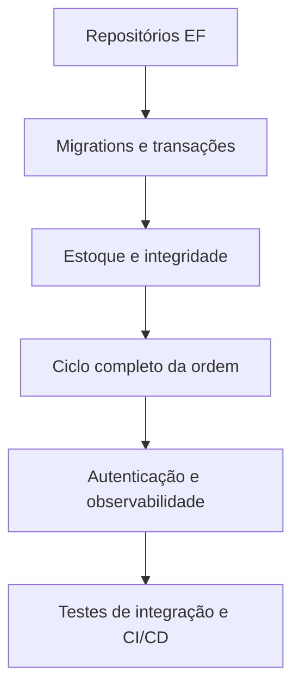

# Melhorias propostas para a aplicação

Este documento registra melhorias priorizadas a partir do estado atual do código.

## Prioridade alta

1. **Concluir a persistência PostgreSQL**
   - Implementar os repositórios concretos usando `AppDbContext`.
   - Alterar `DependencyInjection` para registrar as implementações EF.
   - Remover ou deixar explícito o uso de repositórios em memória apenas em testes.
   - Executar migrations no startup controlado ou em etapa própria de deploy.

2. **Corrigir e consolidar o modelo de estoque**
   - Definir se `StockParts` representa saldo ou movimento; idealmente separar `StockBalance` de `InventoryMovement`.
   - Fazer inclusão do item da ordem, baixa do estoque e registro do movimento na mesma transação.
   - Impedir estoque negativo com regra de domínio e proteção concorrente no banco.

3. **Garantir integridade relacional**
   - Criar índices únicos para documento, placa e código após normalização.
   - Validar que o veículo informado pertence ao cliente da ordem.
   - Revisar `DeleteBehavior`: histórico e itens faturáveis normalmente devem ser preservados, preferindo inativação ou `Restrict`.
   - Tornar propriedades opcionais no modelo quando as chaves estrangeiras puderem ser nulas, especialmente veículo e mecânico.

4. **Completar o ciclo da ordem de serviço**
   - Criar endpoints explícitos para iniciar, finalizar e entregar uma ordem.
   - Registrar cada mudança em `ServiceOrderHistory`.
   - Validar transições permitidas e retornar 409 quando a transição for inválida.

## Prioridade média

5. **Padronizar contratos HTTP**
   - Usar nomes de rota em português ou inglês de forma consistente; hoje o README diverge dos controllers.
   - Retornar DTOs também para ordens, evitando expor entidades diretamente.
   - Adicionar `ProducesResponseType` para conflitos e erros em todos os endpoints.
   - Padronizar paginação e filtros para ordens e demais recursos.

6. **Configuração e segurança**
   - Remover credenciais padrão do `appsettings.json` e usar secrets/environment variables.
   - Adicionar autenticação e autorização por perfil, por exemplo recepção, mecânico e administrador.
   - Configurar CORS por ambiente e limitar exposição do Swagger fora de desenvolvimento.
   - Corrigir o serviço `ef-migrator` do Compose, que atualmente usa imagem, connection string e comando diferentes da API.

7. **Observabilidade**
   - Adicionar logs estruturados com correlation ID.
   - Medir latência, erros, consultas lentas e consumo de estoque.
   - Melhorar o health check para verificar também a conectividade com PostgreSQL quando a persistência for ativada.

## Prioridade baixa

8. **Qualidade e manutenção**
   - Adicionar testes de integração com PostgreSQL em container.
   - Criar testes de contrato para Swagger e códigos HTTP.
   - Configurar pipeline com build, testes, análise estática, migration check e publicação da imagem.
   - Padronizar encoding dos arquivos para evitar textos corrompidos na documentação.

## Sequência sugerida

O maior risco atual é a divergência entre o banco preparado e a persistência efetivamente usada. Por isso, a primeira entrega deve concentrar-se em conectar os casos de uso ao PostgreSQL, validar concorrência e cobrir o fluxo crítico de abertura da ordem, inclusão de peças, baixa de estoque, finalização e entrega.
