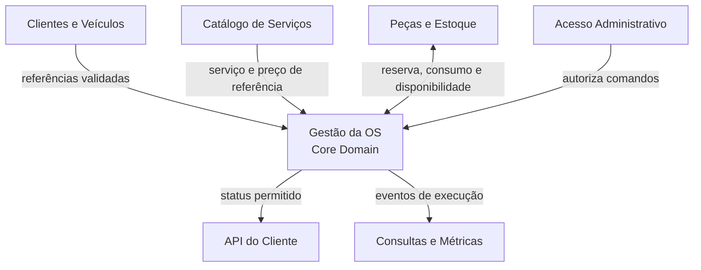

# Nota DDD — Value Objects e Context Map

## Value Objects: regra de uso

Um **Value Object (VO)** representa um conceito do domínio por seu valor, não por uma identidade própria. Ele deve ser imutável, validar-se na criação e ser comparado pelo conteúdo.

Exemplo: duas instâncias de `Placa` com o mesmo valor representam a mesma placa; não faz sentido alterar a placa internamente depois de criada.

## Value Objects recomendados

| Value Object | Conteúdo e validação | Uso principal |
| --- | --- | --- |
| `CpfCnpj` | Documento normalizado, tipo CPF/CNPJ e dígitos verificadores válidos. | Identificação do cliente. |
| `Placa` | Placa normalizada e válida no padrão aceito pela oficina. | Identificação do veículo. |
| `Telefone` | DDI, DDD e número normalizados. | Contato e notificações do cliente. |
| `Email` | Endereço válido e normalizado. | Contato digital do cliente. |
| `Dinheiro` | Valor decimal, moeda BRL e proibição de valores negativos quando aplicável. | Valor unitário, subtotal, total, pagamento e saldo comercial. |
| `Quantidade` | Unidade, escala e valor estritamente positivo quando representa item. | Peças, insumos e serviços quantificáveis. |
| `Quilometragem` | Valor inteiro não negativo em km. | Checklist de entrada e histórico do veículo. |
| `Prioridade` | Nível de prioridade permitido e sua ordenação de negócio. | Priorização da OS. |
| `PeriodoEstimado` | Duração prevista em minutos/horas, sempre não negativa. | Catálogo, estimativa e métricas. |
| `ChecklistEntrada` | Snapshot imutável de condições, acessórios, avarias e quilometragem na recepção. | Evidência da entrada do veículo. |
| `DadosVeiculo` | Marca, modelo e ano validados; a placa permanece como VO específico. | Cadastro e snapshot na OS. |

## O que não deve ser Value Object por padrão

| Conceito | Motivo |
| --- | --- |
| `OrdemServico` | Tem identidade, ciclo de vida e transições de estado. É a raiz de agregado. |
| `Cliente` e `Veiculo` | Possuem identidade própria e histórico. São entidades/agregados. |
| `ItemOrcamento` | Tem decisão individual, valor, execução e pode mudar de estado; é entidade dentro da OS. |
| `Orcamento` | É versionado, auditável e possui itens; é entidade interna da OS no MVP. |
| `ReservaEstoque` | Possui ciclo de vida: criada, liberada, consumida ou expirada. |
| `Autorizacao` | Precisa registrar canal, data/hora, decisor e decisão; é um registro auditável, não somente valor. |

## Regras de implementação

```csharp
public sealed record Placa
{
    public string Valor { get; }

    private Placa(string valor) => Valor = valor;

    public static Placa Criar(string valor)
    {
        var normalizada = valor.Trim().ToUpperInvariant();
        // Validar os padrões aceitos pela oficina antes de criar.
        return new Placa(normalizada);
    }
}
```

- Não expor `set` público em Value Objects.
- Criar tipos distintos para conceitos distintos; não usar `string` para CPF/CNPJ, placa ou dinheiro.
- Centralizar as validações no VO para que regra alguma aceite valor inválido.
- Persistir VOs como owned types, colunas compostas ou conversores, sem perder a semântica no domínio.

## Context Map do monólito modular



### Relações e responsabilidades

| Relação | Upstream → Downstream | Padrão e contrato |
| --- | --- | --- |
| Identificação | Clientes e Veículos → Gestão da OS | A OS referencia IDs e recebe dados válidos. O módulo de clientes não conhece o ciclo da OS. |
| Composição comercial | Catálogo de Serviços → Gestão da OS | O catálogo oferece referência; a OS grava *snapshot* da descrição e do preço aplicado no orçamento. |
| Material | Gestão da OS ↔ Peças e Estoque | A OS solicita reserva/consumo; Estoque preserva a invariável de saldo. Eventos informam reserva ou indisponibilidade. |
| Segurança | Acesso Administrativo → Gestão da OS | JWT e permissões autorizam o comando; regras de negócio continuam dentro do domínio. |
| Transparência ao cliente | Gestão da OS → API do Cliente | Publicação de read model com o mínimo necessário; o cliente consulta, não altera o agregado. |
| Indicadores | Gestão da OS → Consultas e Métricas | Eventos alimentam projeções de fila, status e tempo médio; consistência eventual é aceitável. |

## Eventos que estabilizam o Context Map

- `OS Aberta`
- `Diagnóstico Concluído`
- `Orçamento Emitido`
- `Orçamento Aprovado Totalmente`
- `Orçamento Aprovado Parcialmente`
- `Estoque Reservado`
- `Estoque Indisponível`
- `Serviço Executado`
- `Inspeção Final Aprovada`
- `Pagamento Confirmado`
- `Veículo Entregue`

Esses eventos devem ser publicados **após** a confirmação da transação que os originou. Consultas e Métricas, bem como a API do Cliente, tratam os eventos como fonte para seus modelos de leitura e não como permissão para alterar a OS.

## Decisões de escopo

- Contextos são módulos internos no MVP; não são microserviços.
- Financeiro, entrega, inspeção e retrabalho permanecem dentro da Gestão da OS até que tenham ciclo e equipe independentes.
- Notificações são infraestrutura de aplicação inicialmente; só viram contexto próprio quando a comunicação tiver regras de negócio autônomas.
- Uma ACL é necessária quando um módulo consumidor precisar traduzir um termo ou contrato que não pertence à sua linguagem.
